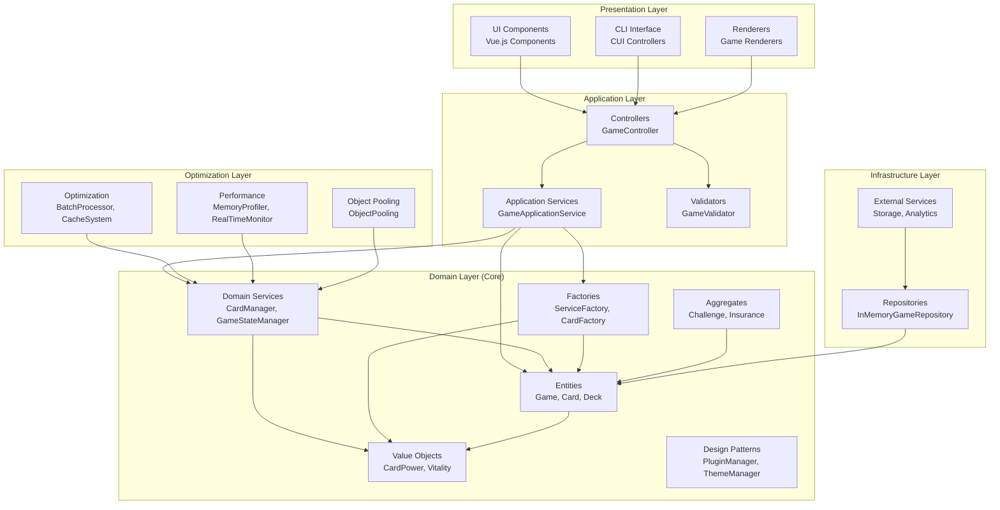
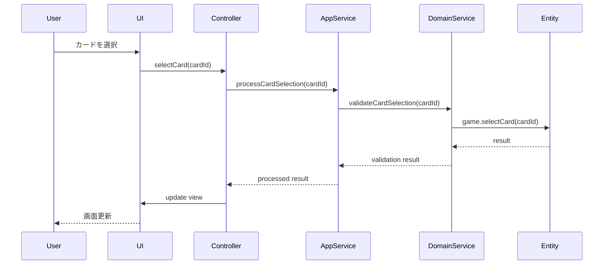

# アーキテクチャドキュメント

> **最終更新**: 2025/07/29  
> **文書種別**: 正式仕様書  
> **更新頻度**: 重大な構造変更時

## 概要

本プロジェクトは **クリーンアーキテクチャ** と **ドメイン駆動設計（DDD）** を基盤とした、高度にモジュール化されたゲームアプリケーションです。各層は明確に責任分離されており、保守性と拡張性を重視した設計となっています。

## アーキテクチャ構成図



## 各層の詳細

### 1. ドメイン層（Domain Layer）

ビジネスロジックの中核を担う層。フレームワークに依存しない純粋なTypeScriptで実装。

#### エンティティ（Entities）
- **`Game`**: ゲーム全体の状態と進行を管理
- **`Card`**: カードの属性と振る舞いを定義
- **`Deck`**: カードの集合体と操作を管理

```typescript
// 使用例
import { Game } from '@/domain/entities/Game'
import { GameConfig } from '@/domain/types/game.types'

const config: GameConfig = { /* ... */ }
const game = new Game(config)
```

#### 値オブジェクト（Value Objects）
- **`CardPower`**: カードパワーの値と検証
- **`Vitality`**: 体力値の管理と計算
- **`InsurancePremium`**: 保険料の計算と検証

```typescript
// 使用例
import { CardPower } from '@/domain/valueObjects/CardPower'

const power = CardPower.create(5) // Result<CardPower>
if (power.success) {
  console.log(power.value.getValue()) // 5
}
```

#### 集約（Aggregates）
- **`Challenge`**: チャレンジイベントの一貫性管理
- **`Insurance`**: 保険契約の整合性保証

#### ドメインサービス（Domain Services）
- **`CardManager`**: カード操作の複雑なロジック
- **`GameStateManager`**: ゲーム状態の管理
- **`InsurancePremiumCalculationService`**: 保険料計算

#### ファクトリー（Factories）
- **`ServiceFactory`**: DIコンテナの実装
- **`CardFactory`**: カードインスタンスの生成

```typescript
// 使用例
import { ServiceFactory } from '@/domain/factories/ServiceFactory'

const cardManager = ServiceFactory.createCardManager()
const stateContext = ServiceFactory.createGameStateContext()
```

#### デザインパターン（Design Patterns）
- **`PluginManager`**: プラグインシステムの管理
- **`ThemeManager`**: テーマシステムの管理
- **`ConfigurationManager`**: 設定システムの管理

### 2. アプリケーション層（Application Layer）

ドメイン層とプレゼンテーション層を仲介し、ユースケースを実装。

#### コントローラー（Controllers）
```typescript
// GameController - メインコントローラー
import { GameController } from '@/controllers/GameController'

const controller = new GameController(config, renderer)
const result = await controller.playGame()
```

#### アプリケーションサービス
```typescript
// GameApplicationService - アプリケーション全体のサービス
import { GameApplicationService } from '@/application/services/GameApplicationService'
```

#### バリデーター
```typescript
// GameValidator - 入力検証
import { GameValidator } from '@/controllers/GameValidator'

const isValid = GameValidator.validateCard(card)
```

### 3. プレゼンテーション層（Presentation Layer）

ユーザーインターフェースとレンダリングを担当。

#### Vue.js コンポーネント
```typescript
// GameCanvas.vue - メインゲーム画面
<template>
  <div class="game-canvas">
    <!-- ゲーム表示 -->
  </div>
</template>
```

#### CUIインターフェース
```typescript
// PlaytestGameController - CUI用コントローラー
import { PlaytestGameController } from '@/cui/PlaytestGameController'

const cuiController = new PlaytestGameController()
await cuiController.startGame()
```

#### レンダラー
```typescript
// PhaserGameRenderer - Phaser.js用レンダラー
import { PhaserGameRenderer } from '@/game/renderers/PhaserGameRenderer'
```

### 4. インフラストラクチャ層（Infrastructure Layer）

外部システムとの連携を担当。

#### リポジトリ
```typescript
// InMemoryGameRepository - ゲーム状態の永続化
import { InMemoryGameRepository } from '@/infrastructure/repositories/InMemoryGameRepository'
```

### 5. 最適化層（Optimization Layer）

パフォーマンスと効率性を向上させる横断的な関心事。

#### 最適化システム
```typescript
// BatchProcessor - バッチ処理の最適化
import { BatchProcessor } from '@/optimization/BatchProcessor'

// CacheSystem - キャッシュシステム
import { CacheSystem } from '@/optimization/CacheSystem'

// ObjectPooling - オブジェクトプール
import { ObjectPool } from '@/optimization/ObjectPooling'
```

## 依存性注入（DI）システム

本プロジェクトは独自のDIコンテナを実装し、疎結合を実現しています。

### ServiceFactory の使用方法

```typescript
import { ServiceFactory } from '@/domain/factories/ServiceFactory'

// 初期化（アプリ起動時に一度実行）
ServiceFactory.initialize()

// サービスの取得
const cardManager = ServiceFactory.createCardManager()
const stateService = ServiceFactory.createGameStateContext()
const progressService = ServiceFactory.createGameProgressService()

// カスタムサービスの登録
ServiceFactory.registerService('customService', () => {
  return new CustomService()
}, 'singleton')
```

### サービスライフタイム

- **singleton**: アプリケーション全体で単一インスタンス
- **transient**: リクエスト毎に新しいインスタンス
- **scoped**: スコープ内で単一インスタンス

## プラグインシステム

拡張可能なプラグインアーキテクチャを採用。

### プラグインの作成

```typescript
import { BasePlugin } from '@/domain/patterns/PluginManager'

class MyPlugin extends BasePlugin {
  readonly metadata = {
    name: 'my-plugin',
    version: '1.0.0',
    description: 'My custom plugin',
    dependencies: []
  }

  readonly hooks = {
    'game:start': this.onGameStart.bind(this)
  }

  private onGameStart() {
    this.log('Game started!')
  }
}

// プラグインの登録
import { globalPluginManager } from '@/domain/patterns/PluginManager'

await globalPluginManager.install(new MyPlugin())
await globalPluginManager.activate('my-plugin')
```

## テーマシステム

動的なテーマ切り替えを実現。

### テーマの使用

```typescript
import { globalThemeManager } from '@/domain/patterns/ThemeManager'

// テーマの適用
globalThemeManager.applyTheme('dark')

// テーマ変更の監視
globalThemeManager.subscribe({
  update(event) {
    console.log(`Theme changed: ${event.currentTheme}`)
  }
})

// Vue Composition API
import { useTheme } from '@/domain/patterns/ThemeManager'

const { currentTheme, applyTheme, availableThemes } = useTheme()
```

## データフロー

### 典型的なゲーム操作のフロー



## エラーハンドリング

### Result型パターン

```typescript
import type { Result } from '@/domain/types/enhanced-types'

// 成功の場合
const success: Result<string> = { success: true, value: "data" }

// エラーの場合
const error: Result<string> = { success: false, error: "Error message" }

// 使用例
function processCard(card: Card): Result<ProcessedCard> {
  if (!card.isValid()) {
    return { success: false, error: "Invalid card" }
  }
  
  const processed = doProcessing(card)
  return { success: true, value: processed }
}
```

### AsyncResult型パターン

```typescript
import type { AsyncResult } from '@/domain/types/enhanced-types'

async function saveGame(game: Game): AsyncResult<void> {
  try {
    await repository.save(game)
    return { success: true }
  } catch (error) {
    return { 
      success: false, 
      error: error instanceof Error ? error.message : String(error) 
    }
  }
}
```

## パフォーマンス最適化

### オブジェクトプール

```typescript
import { ObjectPool } from '@/optimization/ObjectPooling'

// カードプールの作成
const cardPool = ObjectPool.create(
  () => new Card(), // ファクトリー関数
  card => card.reset(), // リセット関数
  50 // 最大プールサイズ
)

// オブジェクトの取得と返却
const card = cardPool.acquire()
// 使用後
cardPool.release(card)
```

### バッチ処理

```typescript
import { BatchProcessor } from '@/optimization/BatchProcessor'

const processor = new BatchProcessor<CardUpdate>(
  updates => processCardUpdates(updates), // バッチ処理関数
  { batchSize: 10, flushInterval: 100 } // オプション
)

// バッチに追加
processor.add(cardUpdate)
```

### キャッシュシステム

```typescript
import { CacheSystem } from '@/optimization/CacheSystem'

const cache = new CacheSystem<string, GameData>({
  maxSize: 1000,
  ttl: 300000 // 5分
})

// キャッシュの使用
const data = cache.get('game-123') || await loadGameData('game-123')
cache.set('game-123', data)
```

## テスト戦略

### 単体テスト
- ドメインエンティティとサービスの単体テスト
- 値オブジェクトの検証テスト

### 統合テスト
- アプリケーションサービスの統合テスト
- コントローラーとレンダラーの連携テスト

### E2Eテスト
- Playwrightを使用したエンドツーエンドテスト
- CUIとGUIの動作確認

## セキュリティ考慮事項

### 入力検証
すべての外部入力は適切にバリデーションされます：

```typescript
// GameValidator による検証
const result = GameValidator.validateCard(userInput)
if (!result.success) {
  throw new ValidationError(result.error)
}
```

### データの不変性
値オブジェクトは不変であり、意図しない変更を防ぎます：

```typescript
// CardPower は不変
const power = CardPower.create(5)
// power.value は読み取り専用
```

## 今後の拡張予定

### プラグインエコシステム
- サードパーティプラグインのサポート
- プラグインストアの実装

### マイクロサービス対応
- ドメインの境界に沿ったサービス分割
- イベント駆動アーキテクチャの導入

### パフォーマンス向上
- WebWorkersを使った並列処理
- WebAssembly（WASM）の活用

## まとめ

本アーキテクチャは以下の原則に基づいて設計されています：

1. **単一責任の原則**: 各クラス・モジュールは明確な責任を持つ
2. **依存性逆転の原則**: 抽象に依存し、具象に依存しない
3. **開放閉鎖の原則**: 拡張に対して開かれ、修正に対して閉じている
4. **分離の原則**: 関心事を適切に分離している

これにより、保守性、テスト可能性、拡張性を高いレベルで実現しています。