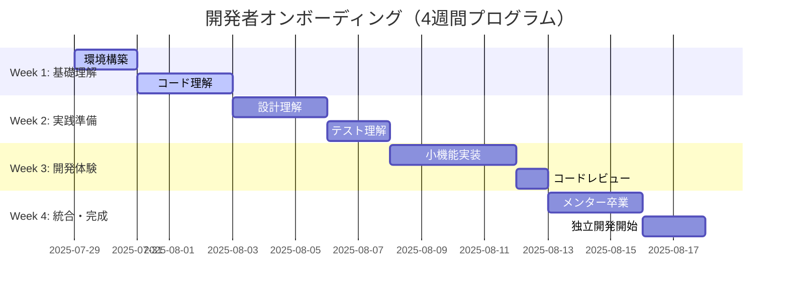
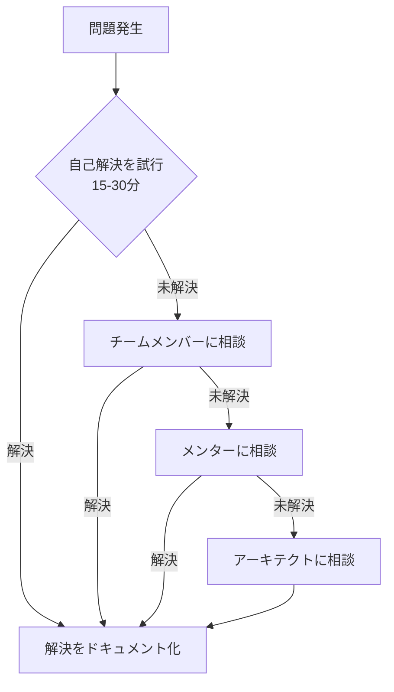

# 開発者オンボーディングガイド

> **最終更新**: 2025/07/29  
> **文書種別**: 正式仕様書  
> **更新頻度**: 開発プロセス変更時

## 概要

本ドキュメントは、新しく参加する開発者がプロジェクトを理解し、効率的に開発に参加できるようにするための包括的なオンボーディングガイドです。技術的な理解から実践的な開発ワークフローまで、段階的に学習できる構成になっています。

## オンボーディング行程表



## Week 1: 基礎理解と環境構築

### Day 1-2: 開発環境セットアップ

#### 必要なツールのインストール

```bash
# Node.js (18以上) インストール確認
node --version

# pnpm インストール
npm install -g pnpm

# Claude Code CLI インストール
npm install -g @anthropic/claude-cli

# Git 設定確認
git config --global user.name "Your Name"
git config --global user.email "your.email@example.com"
```

#### プロジェクトクローンとセットアップ

```bash
# リポジトリクローン
git clone https://github.com/your-org/insurance_game.git
cd insurance_game

# 依存関係インストール
npm install

# 開発サーバー起動
npm run dev

# ビルド確認
npm run build

# テスト実行
npm run test
```

#### IDE/エディタ設定

**VS Code推奨拡張機能**:
```json
{
  "recommendations": [
    "vue.volar",
    "johnsoncodehk.vscode-typescript-vue-plugin",
    "esbenp.prettier-vscode",
    "bradlc.vscode-tailwindcss",
    "ms-vscode.vscode-typescript-next",
    "vitest.explorer"
  ]
}
```

**設定ファイル** (`.vscode/settings.json`):
```json
{
  "typescript.preferences.importModuleSpecifier": "relative",
  "editor.formatOnSave": true,
  "editor.defaultFormatter": "esbenp.prettier-vscode",
  "editor.codeActionsOnSave": {
    "source.fixAll.eslint": true
  }
}
```

#### チェックリスト

- [ ] Node.js 18+ インストール済み
- [ ] pnpm コマンド利用可能
- [ ] Claude Code CLI インストール済み
- [ ] リポジトリクローン完了
- [ ] `npm run dev` で開発サーバー起動成功
- [ ] `npm run test` でテスト実行成功
- [ ] VS Code with 推奨拡張機能インストール

### Day 3-5: コードベース理解

#### アーキテクチャ学習パス

1. **プロジェクト構造の理解**
   ```bash
   # ファイル構造確認
   tree src/ -I "node_modules|__tests__|*.test.ts"
   
   # 主要ファイルの説明を読む
   cat README.md
   cat CLAUDE.md
   ```

2. **ドメイン層の理解**
   ```typescript
   // src/domain/entities/Game.ts を読む
   // - ゲームの基本概念
   // - 状態管理の仕組み
   // - ビジネスルール

   // src/domain/valueObjects/ を読む
   // - CardPower, Vitality, InsurancePremium
   // - 値オブジェクトの設計パターン
   ```

3. **アプリケーション層の理解**
   ```typescript
   // src/controllers/GameController.ts を読む
   // - MVC パターンの実装
   // - ゲームフローの制御
   
   // src/application/services/ を読む
   // - アプリケーションサービス
   // - ユースケースの実装
   ```

4. **プレゼンテーション層の理解**
   ```vue
   <!-- src/components/game/GameCanvas.vue を読む -->
   <!-- - Vue.js コンポーネント設計 -->
   <!-- - 状態管理との連携 -->
   ```

#### 実践演習: コード読解

```typescript
// 演習 1: Game エンティティの理解
// src/domain/entities/Game.ts を読んで以下の質問に答える

// Q1: ゲームの状態遷移はどのように管理されているか？
// Q2: カードの選択処理はどこで実装されているか？
// Q3: エラーハンドリングはどのようなパターンを使っているか？

// 演習 2: 値オブジェクトの理解
// src/domain/valueObjects/CardPower.ts を読んで実装する

class CardPowerExercise {
  // TODO: create メソッドの仕組みを説明せよ
  // TODO: Result型の利点を説明せよ
  // TODO: 不変性がどのように保証されているか説明せよ
}
```

#### チェックリスト

- [ ] プロジェクト全体構造を理解
- [ ] ドメイン駆動設計（DDD）の基本概念を理解
- [ ] クリーンアーキテクチャの各層の役割を理解
- [ ] 主要なデザインパターンを識別
- [ ] Result型によるエラーハンドリングを理解
- [ ] TypeScript の高度な型機能の使用を理解

## Week 2: 設計とテストの理解

### Day 6-8: 設計パターンとアーキテクチャ

#### SOLID原則の実践例

```typescript
// 1. Single Responsibility Principle (単一責任の原則)
// ❌ Bad: 複数の責任を持つクラス
class BadGameManager {
  processGame() { /* ゲーム処理 */ }
  saveGame() { /* データ保存 */ }
  renderGame() { /* 画面描画 */ }
  playSound() { /* 音声再生 */ }
}

// ✅ Good: 責任が分離されたクラス
class GameProcessor {
  processGame() { /* ゲーム処理のみ */ }
}

class GameRepository {
  saveGame() { /* データ保存のみ */ }
}

class GameRenderer {
  renderGame() { /* 画面描画のみ */ }
}

// 2. Dependency Inversion Principle (依存性逆転の原則)
// ✅ インターフェースに依存する設計
interface IGameRepository {
  save(game: Game): Promise<void>
  load(id: string): Promise<Game | null>
}

class GameService {
  constructor(private repository: IGameRepository) {}
  
  async saveGame(game: Game) {
    await this.repository.save(game)
  }
}
```

#### デザインパターンの実装例

```typescript
// Factory Pattern
class GameFactory {
  static createGame(config: GameConfig): Game {
    return new Game(config)
  }
  
  static createCard(type: CardType, power: number): Result<Card> {
    // カード作成ロジック
  }
}

// Observer Pattern
class GameEventEmitter {
  private listeners: Map<string, Function[]> = new Map()
  
  subscribe(event: string, callback: Function) {
    const callbacks = this.listeners.get(event) || []
    callbacks.push(callback)
    this.listeners.set(event, callbacks)
  }
  
  emit(event: string, data: any) {
    const callbacks = this.listeners.get(event) || []
    callbacks.forEach(callback => callback(data))
  }
}

// Strategy Pattern (プラグインシステム)
interface GamePlugin {
  execute(context: GameContext): void
}

class PluginManager {
  private plugins: Map<string, GamePlugin> = new Map()
  
  register(name: string, plugin: GamePlugin) {
    this.plugins.set(name, plugin)
  }
  
  executeAll(context: GameContext) {
    this.plugins.forEach(plugin => plugin.execute(context))
  }
}
```

#### 実践演習: 設計改善

```typescript
// 演習 3: リファクタリング課題
// 以下のコードを SOLID 原則に従って改善する

class GameManagerToRefactor {
  private game: Game
  private renderer: any
  private storage: any
  
  constructor() {
    this.game = new Game({})
    this.renderer = new CanvasRenderer()
    this.storage = localStorage
  }
  
  playGame() {
    // ゲーム処理
    this.game.start()
    
    // 描画
    this.renderer.render(this.game.getState())
    
    // 保存
    this.storage.setItem('game', JSON.stringify(this.game.getState()))
    
    // ログ出力
    console.log('Game played')
    
    // スコア計算
    const score = this.calculateScore()
    
    // 通知
    alert(`Score: ${score}`)
  }
  
  private calculateScore(): number {
    // スコア計算ロジック
    return 100
  }
}

// TODO: 上記のクラスを複数のクラスに分割し、
//       適切な依存関係注入を実装する
```

### Day 9-10: テスト戦略とTDD

#### テスト環境の理解

```bash
# テスト実行コマンドの確認
npm run test:unit        # 単体テスト
npm run test:integration # 統合テスト
npm run test:e2e        # E2Eテスト
npm run test:coverage   # カバレッジ測定
```

#### 単体テストの書き方

```typescript
// src/domain/entities/__tests__/Game.test.ts
import { describe, it, expect, beforeEach } from 'vitest'
import { Game } from '../Game'
import { GameConfig } from '../../types/game.types'

describe('Game Entity', () => {
  let game: Game
  let config: GameConfig

  beforeEach(() => {
    config = {
      initialVitality: 100,
      maxTurns: 10,
      difficulty: 'normal'
    }
    game = new Game(config)
  })

  describe('初期化', () => {
    it('正しい初期状態を持つ', () => {
      expect(game.getStatus()).toBe('waiting')
      expect(game.getVitality().getValue()).toBe(100)
      expect(game.getCurrentTurn()).toBe(0)
    })
  })

  describe('ゲーム開始', () => {
    it('ゲームを開始できる', () => {
      game.start()
      expect(game.getStatus()).toBe('in_progress')
    })
    
    it('既に開始済みの場合はエラーを返す', () => {
      game.start()
      const result = game.start()
      expect(result.success).toBe(false)
      expect(result.error).toContain('already started')
    })
  })

  describe('カード選択', () => {
    beforeEach(() => {
      game.start()
    })

    it('有効なカードを選択できる', () => {
      const cards = game.getCurrentCards()
      const firstCard = cards[0]
      
      const result = game.selectCard(firstCard.getId())
      expect(result.success).toBe(true)
    })

    it('無効なカードIDでエラーを返す', () => {
      const result = game.selectCard('invalid-id')
      expect(result.success).toBe(false)
      expect(result.error).toContain('not found')
    })
  })
})
```

#### 統合テストの書き方

```typescript
// src/__tests__/integration/GameWorkflow.integration.test.ts
import { describe, it, expect } from 'vitest'
import { GameController } from '@/controllers/GameController'
import { MockRenderer } from '@/test/mocks/MockRenderer'

describe('Game Workflow Integration', () => {
  it('完全なゲームフローを実行できる', async () => {
    // Arrange
    const renderer = new MockRenderer()
    const controller = new GameController({
      initialVitality: 100,
      maxTurns: 5,
      difficulty: 'easy'
    }, renderer)

    // Act
    const result = await controller.playGame()

    // Assert
    expect(result).toBeDefined()
    expect(result.finalScore).toBeGreaterThanOrEqual(0)
    expect(renderer.getCallHistory()).toContain('initialize')
    expect(renderer.getCallHistory()).toContain('showFinalResult')
  })
})
```

#### TDD実践演習

```typescript
// 演習 4: TDD でカード効果システムを実装
// 以下のテストが通るようにコードを実装する

describe('CardEffect System', () => {
  it('ヒールカードで体力を回復できる', () => {
    const game = new Game({ initialVitality: 50 })
    const healCard = CardFactory.createHealCard(20)
    
    game.start()
    const result = game.applyCardEffect(healCard)
    
    expect(result.success).toBe(true)
    expect(game.getVitality().getValue()).toBe(70)
  })

  it('アタックカードでダメージを与える', () => {
    const game = new Game({ initialVitality: 100 })
    const attackCard = CardFactory.createAttackCard(30)
    
    game.start()
    const result = game.applyCardEffect(attackCard)
    
    expect(result.success).toBe(true)
    expect(game.getVitality().getValue()).toBe(70)
  })
})

// TODO: 上記のテストが通るように CardEffect システムを実装する
```

#### チェックリスト

- [ ] SOLID原則の各項目を理解し、実装例を識別
- [ ] 主要なデザインパターンの実装を理解
- [ ] 単体テストの書き方を習得
- [ ] 統合テストの概念を理解
- [ ] TDDサイクル（Red-Green-Refactor）を実践
- [ ] モックとスタブの使い分けを理解

## Week 3: 実践的な開発体験

### Day 11-14: 機能実装演習

#### 演習課題: 実績システムの実装

新機能として「実績システム」を実装します。これは実際のプロジェクト開発で行われる作業と同等の複雑さを持つ課題です。

##### ステップ1: 要件定義と設計

```typescript
// 要件:
// 1. プレイヤーの行動に基づいて実績を解除
// 2. 実績には段階的なレベルがある
// 3. 実績解除時に通知を表示
// 4. 実績の進捗を表示

// 設計: まずインターフェースを定義
interface Achievement {
  readonly id: string
  readonly name: string
  readonly description: string
  readonly type: AchievementType
  readonly levels: AchievementLevel[]
  isUnlocked(level: number): boolean
  getCurrentProgress(): number
  getNextLevelRequirement(): number | null
}

interface AchievementLevel {
  readonly level: number
  readonly requirement: number
  readonly reward: AchievementReward
}

type AchievementType = 'score' | 'survival' | 'cards_played' | 'games_completed'
```

##### ステップ2: TDDでドメインロジック実装

```typescript
// src/domain/entities/__tests__/Achievement.test.ts
describe('Achievement Entity', () => {
  let scoreAchievement: Achievement

  beforeEach(() => {
    scoreAchievement = new ScoreAchievement({
      id: 'high-scorer',
      name: 'High Scorer',
      description: 'Reach high scores',
      levels: [
        { level: 1, requirement: 1000, reward: { points: 10 } },
        { level: 2, requirement: 5000, reward: { points: 50 } },
        { level: 3, requirement: 10000, reward: { points: 100 } }
      ]
    })
  })

  it('初期状態では実績が解除されていない', () => {
    expect(scoreAchievement.isUnlocked(1)).toBe(false)
    expect(scoreAchievement.getCurrentProgress()).toBe(0)
  })

  it('要件を満たすと実績が解除される', () => {
    scoreAchievement.updateProgress(1500)
    
    expect(scoreAchievement.isUnlocked(1)).toBe(true)
    expect(scoreAchievement.isUnlocked(2)).toBe(false)
    expect(scoreAchievement.getCurrentProgress()).toBe(1500)
    expect(scoreAchievement.getNextLevelRequirement()).toBe(5000)
  })
})

// TODO: このテストが通るように Achievement クラスを実装
```

##### ステップ3: サービス層の実装

```typescript
// src/domain/services/AchievementService.ts
export class AchievementService {
  private achievements: Map<string, Achievement> = new Map()
  private eventEmitter: EventEmitter

  constructor(eventEmitter: EventEmitter) {
    this.eventEmitter = eventEmitter
    this.setupEventListeners()
  }

  registerAchievement(achievement: Achievement): void {
    this.achievements.set(achievement.id, achievement)
  }

  checkAchievements(gameStats: GameStats): UnlockedAchievement[] {
    const unlockedAchievements: UnlockedAchievement[] = []

    for (const achievement of this.achievements.values()) {
      const previousProgress = achievement.getCurrentProgress()
      achievement.updateProgress(this.getProgressValue(achievement, gameStats))
      
      // 新しく解除されたレベルを確認
      const newlyUnlocked = this.checkNewlyUnlockedLevels(achievement, previousProgress)
      unlockedAchievements.push(...newlyUnlocked)
    }

    return unlockedAchievements
  }

  private setupEventListeners(): void {
    this.eventEmitter.on('game:completed', (gameResult) => {
      this.checkAchievements(gameResult.stats)
    })

    this.eventEmitter.on('card:played', (cardData) => {
      // カード使用関連の実績をチェック
    })
  }

  // TODO: 他のメソッドを実装
}
```

##### ステップ4: UI コンポーネントの実装

```vue
<!-- src/components/achievements/AchievementNotification.vue -->
<template>
  <Transition
    name="achievement"
    appear
  >
    <div 
      v-if="visible"
      class="achievement-notification"
      @click="handleClick"
    >
      <div class="achievement-icon">
        <Icon :name="achievement.iconName" />
      </div>
      <div class="achievement-content">
        <h3 class="achievement-title">実績解除!</h3>
        <p class="achievement-name">{{ achievement.name }}</p>
        <p class="achievement-description">{{ achievement.description }}</p>
        <div class="achievement-progress">
          レベル {{ achievement.level }} 達成
        </div>
      </div>
    </div>
  </Transition>
</template>

<script setup lang="ts">
import { ref, onMounted } from 'vue'
import type { UnlockedAchievement } from '@/domain/types/achievement.types'

interface Props {
  achievement: UnlockedAchievement
  duration?: number
}

const props = withDefaults(defineProps<Props>(), {
  duration: 4000
})

const emit = defineEmits<{
  close: []
}>()

const visible = ref(false)

onMounted(() => {
  visible.value = true
  
  setTimeout(() => {
    visible.value = false
    setTimeout(() => emit('close'), 300)
  }, props.duration)
})

const handleClick = () => {
  visible.value = false
  setTimeout(() => emit('close'), 300)
}
</script>

<style scoped>
.achievement-notification {
  position: fixed;
  top: 2rem;
  right: 2rem;
  max-width: 400px;
  background: linear-gradient(135deg, var(--color-brand-primary), var(--color-brand-secondary));
  border-radius: var(--spacing-md);
  padding: var(--spacing-lg);
  box-shadow: var(--shadow-xl);
  display: flex;
  align-items: center;
  gap: var(--spacing-md);
  cursor: pointer;
  z-index: 1000;
  backdrop-filter: blur(10px);
}

.achievement-icon {
  font-size: 3rem;
  color: gold;
  text-shadow: 0 0 10px rgba(255, 215, 0, 0.5);
}

.achievement-title {
  color: white;
  font-size: var(--typography-fontSize-lg);
  font-weight: var(--typography-fontWeight-bold);
  margin: 0 0 var(--spacing-xs);
  text-shadow: 0 1px 2px rgba(0, 0, 0, 0.3);
}

.achievement-name {
  color: rgba(255, 255, 255, 0.95);
  font-weight: var(--typography-fontWeight-medium);
  margin: 0 0 var(--spacing-xs);
}

.achievement-description {
  color: rgba(255, 255, 255, 0.8);
  font-size: var(--typography-fontSize-sm);
  margin: 0 0 var(--spacing-xs);
}

.achievement-progress {
  color: gold;
  font-size: var(--typography-fontSize-xs);
  font-weight: var(--typography-fontWeight-bold);
  text-transform: uppercase;
  letter-spacing: 0.5px;
}

/* アニメーション */
.achievement-enter-active {
  transition: all 0.4s cubic-bezier(0.175, 0.885, 0.32, 1.275);
}

.achievement-leave-active {
  transition: all 0.3s ease-in;
}

.achievement-enter-from {
  opacity: 0;
  transform: translateX(100%) scale(0.8);
}

.achievement-leave-to {
  opacity: 0;
  transform: translateX(100%) scale(0.8);
}
</style>
```

##### ステップ5: 統合とテスト

```typescript
// 統合テスト
describe('Achievement System Integration', () => {
  it('ゲーム完了時に実績が解除される', async () => {
    const gameController = new GameController(config, renderer)
    const achievementService = new AchievementService(eventEmitter)
    
    // 高得点実績を登録
    achievementService.registerAchievement(highScoreAchievement)
    
    // ゲームプレイ（高得点を狙う）
    const result = await gameController.playGame()
    
    // 実績が解除されることを確認
    expect(result.unlockedAchievements).toHaveLength(1)
    expect(result.unlockedAchievements[0].id).toBe('high-scorer')
  })
})
```

#### チェックリスト

- [ ] 要件定義から設計まで一連の流れを実践
- [ ] TDDサイクルで開発を進行
- [ ] ドメイン層、アプリケーション層、プレゼンテーション層を実装
- [ ] 統合テストで動作確認
- [ ] コードレビューの準備完了

### Day 15: コードレビューとフィードバック

#### セルフコードレビューチェックリスト

```typescript
// コードレビュー観点
class CodeReviewChecklist {
  // 1. アーキテクチャ観点
  checkArchitecture() {
    // - 適切な層に実装されているか？
    // - 依存関係の向きは正しいか？
    // - 単一責任の原則を守っているか？
  }

  // 2. 設計観点  
  checkDesign() {
    // - インターフェースは適切に抽象化されているか？
    // - エラーハンドリングは適切か？
    // - 拡張性を考慮した設計か？
  }

  // 3. 実装観点
  checkImplementation() {
    // - TypeScript の型を効果的に使っているか？
    // - パフォーマンスを考慮しているか？
    // - セキュリティ面は大丈夫か？
  }

  // 4. テスト観点
  checkTesting() {
    // - テストカバレッジは十分か？
    // - エッジケースをテストしているか？
    // - テストが読みやすいか？
  }
}
```

#### フィードバック例と改善

```typescript
// フィードバック前のコード
class AchievementManager {
  public achievements: Achievement[] = [] // ❌ public field
  
  public addAchievement(achievement: any) { // ❌ any型
    this.achievements.push(achievement)
  }
  
  public checkAchievements(score: number) { // ❌ 単一の値のみ
    for (let i = 0; i < this.achievements.length; i++) { // ❌ imperative style
      if (this.achievements[i].requirement <= score) {
        console.log('Achievement unlocked!') // ❌ direct console output
      }
    }
  }
}

// フィードバック後の改善されたコード
class AchievementManager {
  private readonly achievements: Map<string, Achievement> = new Map() // ✅ private, readonly
  
  constructor(private readonly logger: ILogger) {} // ✅ dependency injection
  
  public registerAchievement(achievement: Achievement): Result<void> { // ✅ proper types, Result type
    if (this.achievements.has(achievement.id)) {
      return { success: false, error: `Achievement ${achievement.id} already exists` }
    }
    
    this.achievements.set(achievement.id, achievement)
    return { success: true }
  }
  
  public checkAchievements(gameStats: GameStats): UnlockedAchievement[] { // ✅ comprehensive input type
    const unlockedAchievements: UnlockedAchievement[] = []
    
    for (const achievement of this.achievements.values()) { // ✅ functional style
      if (achievement.checkUnlock(gameStats)) {
        unlockedAchievements.push({
          id: achievement.id,
          name: achievement.name,
          level: achievement.getCurrentLevel(),
          unlockedAt: new Date()
        })
        
        this.logger.info(`Achievement unlocked: ${achievement.name}`) // ✅ proper logging
      }
    }
    
    return unlockedAchievements
  }
}
```

## Week 4: 独立開発への準備

### Day 16-18: メンターとの協働

#### 実践的な開発タスク

現在のプロジェクトから実際のタスクを選択して実装：

1. **バグ修正**: 既知の問題から適切なレベルのものを選択
2. **小機能追加**: プラグインシステムを使った拡張機能
3. **リファクタリング**: コード品質改善
4. **ドキュメント更新**: 実装に伴うドキュメント更新

#### メンターレビューポイント

```typescript
// メンターが確認するポイント
interface MentorReviewCriteria {
  technicalSkills: {
    architectureUnderstanding: number // アーキテクチャ理解度
    codeQuality: number // コード品質
    testingSkills: number // テスト技術
    problemSolving: number // 問題解決能力
  }
  
  processSkills: {
    gitWorkflow: number // Git ワークフロー理解
    codeReview: number // コードレビュー参加度
    documentation: number // ドキュメント作成能力
    communication: number // コミュニケーション
  }
  
  domainKnowledge: {
    businessLogic: number // ビジネスロジック理解
    gameDesign: number // ゲーム設計理解
    userExperience: number // UX 理解
  }
}
```

### Day 19-20: 独立開発開始

#### 自立開発チェックリスト

**技術的準備**:
- [ ] プロジェクト全体のアーキテクチャを理解
- [ ] 主要なデザインパターンを適用できる
- [ ] TDDサイクルで開発できる
- [ ] 適切なエラーハンドリングを実装できる
- [ ] パフォーマンスを考慮した実装ができる

**開発プロセス**:
- [ ] Git ワークフローを理解している
- [ ] コードレビューに参加できる
- [ ] 適切なコミットメッセージを書ける
- [ ] ドキュメントを更新できる
- [ ] CI/CD パイプラインを理解している

**コミュニケーション**:
- [ ] 技術的な質問を適切にできる
- [ ] 実装の意図を説明できる
- [ ] コードレビューでフィードバックを受け入れられる
- [ ] 他の開発者と協働できる

#### 継続学習計画

```typescript
// 個人学習計画テンプレート
interface LearningPlan {
  shortTerm: { // 1-3ヶ月
    technicalSkills: string[]
    domainKnowledge: string[]
    projects: string[]
  }
  
  mediumTerm: { // 3-6ヶ月
    specialization: string[]
    leadership: string[]
    contribution: string[]
  }
  
  longTerm: { // 6-12ヶ月
    expertise: string[]
    mentoring: string[]
    innovation: string[]
  }
}

const myLearningPlan: LearningPlan = {
  shortTerm: {
    technicalSkills: [
      'TypeScript高度な型システム',
      'Vue.js 3 Composition API',
      'パフォーマンス最適化技法'
    ],
    domainKnowledge: [
      'ゲーム設計理論',
      'UX設計原則',
      'アクセシビリティ標準'
    ],
    projects: [
      '新機能の完全実装',
      'レガシーコードのリファクタリング',
      'パフォーマンス改善プロジェクト'
    ]
  },
  
  mediumTerm: {
    specialization: [
      'ゲームエンジン深掘り',
      'WebGL/WebAssembly',
      'リアルタイム通信'
    ],
    leadership: [
      '技術仕様書作成',
      'アーキテクチャ設計',
      'チームレビュー主導'
    ],
    contribution: [
      'オープンソース貢献',
      '技術記事執筆',
      '社内勉強会開催'
    ]
  },
  
  longTerm: {
    expertise: [
      'システムアーキテクト',
      'パフォーマンスエキスパート',
      'UX エンジニア'
    ],
    mentoring: [
      '新人開発者指導',
      'オンボーディング改善',
      '技術研修企画'
    ],
    innovation: [
      '新技術導入提案',
      '開発プロセス改善',
      'ツール開発'
    ]
  }
}
```

## リソースとツール

### 必読ドキュメント

1. **プロジェクト固有**:
   - [CLAUDE.md](../../CLAUDE.md) - プロジェクト企画書
   - [PRINCIPLES.md](./PRINCIPLES.md) - 開発原則
   - [ARCHITECTURE.md](./ARCHITECTURE.md) - アーキテクチャ詳細

2. **技術資料**:
   - [TypeScript Handbook](https://www.typescriptlang.org/docs/)
   - [Vue.js 3 Documentation](https://vuejs.org/guide/)
   - [Clean Architecture](https://blog.cleancoder.com/uncle-bob/2012/08/13/the-clean-architecture.html)

3. **設計資料**:
   - [Domain-Driven Design](https://domainlanguage.com/ddd/)
   - [SOLID Principles](https://en.wikipedia.org/wiki/SOLID)
   - [Design Patterns](https://refactoring.guru/design-patterns)

### 開発ツール

```bash
# 必須ツール
npm install -g @anthropic/claude-cli
npm install -g @vue/cli
npm install -g typescript
npm install -g vitest

# 推奨ツール
npm install -g eslint
npm install -g prettier
npm install -g lighthouse
npm install -g npm-check-updates
```

### 学習リソース

```typescript
// 学習リソースマップ
const learningResources = {
  beginner: {
    typescript: [
      'TypeScript in 5 minutes',
      'TypeScript Handbook - Basics'
    ],
    vue: [
      'Vue.js 3 Tutorial',
      'Composition API Guide'
    ],
    testing: [
      'Vitest Getting Started',
      'Testing Vue Components'
    ]
  },
  
  intermediate: {
    architecture: [
      'Clean Architecture Book',
      'Domain-Driven Design Distilled'
    ],
    patterns: [
      'Design Patterns: Elements of Reusable Object-Oriented Software',
      'Refactoring Guru Patterns'
    ],
    performance: [
      'High Performance Browser Networking',
      'Web Performance Optimization'
    ]
  },
  
  advanced: {
    systems: [
      'Designing Data-Intensive Applications',
      'System Design Interview'
    ],
    leadership: [
      'The Tech Lead\'s New Project Checklist',
      'Staff Engineer: Leadership beyond the management track'
    ]
  }
}
```

## トラブル時の相談先

### 段階的エスカレーション



### 相談時のテンプレート

```typescript
// 相談テンプレート
interface ConsultationRequest {
  summary: string // 問題の要約（1-2行）
  context: {
    task: string // 取り組んでいるタスク
    expected: string // 期待する動作
    actual: string // 実際の動作
  }
  investigation: {
    attempted: string[] // 試行した解決策
    timeSpent: string // 調査に費やした時間
    blockers: string[] // 現在の障害点
  }
  artifacts: {
    codeSnippets?: string // 関連コード
    errorMessages?: string // エラーメッセージ
    screenshots?: string // スクリーンショット
  }
  urgency: 'low' | 'medium' | 'high' | 'critical'
}

// 使用例
const consultationExample: ConsultationRequest = {
  summary: "カード選択時にTypeScriptの型エラーが発生",
  context: {
    task: "実績システムでカード使用イベントをリッスン",
    expected: "カード選択時にachievementServiceが呼び出される",
    actual: "TypeScript型エラーでビルドが失敗"
  },
  investigation: {
    attempted: [
      "型定義を確認",
      "インターフェースの実装を確認",
      "類似の実装コードを参照"
    ],
    timeSpent: "約30分",
    blockers: [
      "Card型とAchievementEvent型の互換性",
      "ジェネリクス型の理解不足"
    ]
  },
  artifacts: {
    codeSnippets: `
      // エラーが発生するコード
      const handleCardSelect = (card: Card) => {
        achievementService.recordEvent({
          type: 'card-played',
          data: card // ここで型エラー
        })
      }
    `,
    errorMessages: "TS2345: Argument of type 'Card' is not assignable to parameter of type 'CardPlayedEventData'"
  },
  urgency: 'medium'
}
```

## 卒業認定

### 最終課題

プロジェクトに実際に貢献する機能を完全に実装し、本番デプロイまで行う：

1. **要件定義**: プロジェクトオーナーと要件を調整
2. **設計書作成**: アーキテクチャに適合した設計
3. **実装**: TDDでの完全実装
4. **テスト**: 十分なテストカバレッジ
5. **レビュー**: コードレビューをパス
6. **デプロイ**: 本番環境への安全なデプロイ
7. **監視**: デプロイ後の動作監視
8. **ドキュメント**: 実装に伴うドキュメント更新

### 卒業要件

- [ ] 技術的要件をすべて満たす
- [ ] プロセス要件をすべて満たす
- [ ] メンターからの最終承認
- [ ] チームメンバーからのポジティブフィードバック
- [ ] 実装した機能が本番で正常動作
- [ ] 継続学習計画の策定完了

## まとめ

このオンボーディングプログラムを通じて、以下のスキルが身につきます：

### 技術スキル
- **TypeScript**: 高度な型システムの活用
- **Vue.js 3**: Composition APIの効果的な使用
- **クリーンアーキテクチャ**: 保守可能な設計の実践
- **TDD**: テスト駆動開発の実践
- **パフォーマンス**: 効率的な実装技法

### プロセススキル
- **Git**: 効果的なバージョン管理
- **コードレビュー**: 建設的なフィードバック
- **ドキュメント**: 技術文書の作成
- **協働**: チーム開発での協調

### ドメインスキル
- **ゲーム設計**: インタラクティブな体験設計
- **UX**: ユーザー中心の設計思考
- **システム設計**: スケーラブルなアーキテクチャ

4週間のプログラム完了後も、継続的な学習と成長を通じて、プロジェクトの中核メンバーとして活躍できる基盤が整います。