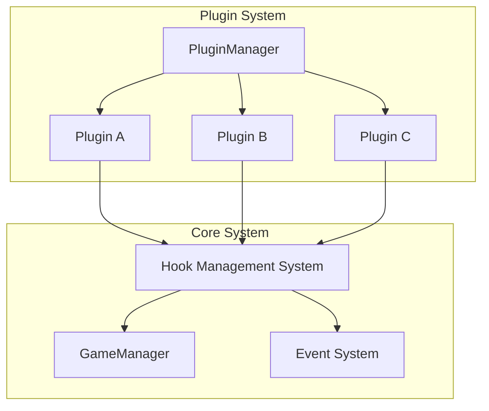

# 拡張ガイド

> **最終更新**: 2025/07/29  
> **文書種別**: 正式仕様書  
> **更新頻度**: 機能追加時

## 概要

本ドキュメントは、ゲームシステムの拡張方法について詳細に説明します。プラグインシステム、テーマシステム、設定システムの使用方法から、新機能の追加手順まで、開発者が効率的に機能拡張できるよう支援します。

## 目次

1. [プラグインシステム](#プラグインシステム)
2. [テーマシステム](#テーマシステム)
3. [設定システム](#設定システム)
4. [新機能追加手順](#新機能追加手順)
5. [カスタムコンポーネント作成](#カスタムコンポーネント作成)
6. [API拡張](#api拡張)
7. [デバッグとテスト](#デバッグとテスト)

## プラグインシステム

### プラグインアーキテクチャ



### 基本的なプラグインの作成

#### 1. プラグインクラスの実装

```typescript
// src/plugins/MyGamePlugin.ts
import { BasePlugin } from '@/domain/patterns/PluginManager'
import type { PluginMetadata } from '@/domain/types/enhanced-types'

export class MyGamePlugin extends BasePlugin {
  readonly metadata: PluginMetadata = {
    name: 'my-game-plugin',
    version: '1.0.0',
    description: 'カスタムゲーム機能を追加するプラグイン',
    author: 'Your Name',
    dependencies: [], // 依存するプラグイン名
    permissions: ['game:modify', 'ui:extend'] // 必要な権限
  }

  readonly hooks = {
    // ゲーム開始時のフック
    'game:start': this.onGameStart.bind(this),
    // カード選択時のフック  
    'card:select': this.onCardSelect.bind(this),
    // ターン終了時のフック
    'turn:end': this.onTurnEnd.bind(this)
  }

  // プラグインインストール時の処理
  async onInstall(): Promise<void> {
    this.log('プラグインをインストールしています...', 'info')
    // 必要なリソースの準備
    await this.setupResources()
  }

  // プラグイン有効化時の処理
  async onActivate(): Promise<void> {
    this.log('プラグインを有効化しています...', 'info')
    // UI要素の追加
    this.addCustomUI()
    // イベントリスナーの登録
    this.registerEventListeners()
  }

  // プラグイン無効化時の処理
  async onDeactivate(): Promise<void> {
    this.log('プラグインを無効化しています...', 'info')
    // リソースのクリーンアップ
    this.cleanup()
  }

  // ゲーム開始時の処理
  private onGameStart(gameData: any) {
    this.log('ゲームが開始されました')
    // カスタム処理の実装
    this.initializeCustomFeatures(gameData)
  }

  // カード選択時の処理
  private onCardSelect(cardData: any) {
    this.log(`カードが選択されました: ${cardData.name}`)
    // カード選択の拡張処理
    return this.enhanceCardSelection(cardData)
  }

  // ターン終了時の処理
  private onTurnEnd(turnData: any) {
    this.log('ターンが終了しました')
    // ターン終了時のカスタム処理
    this.processTurnEnd(turnData)
  }

  // プライベートメソッド
  private async setupResources(): Promise<void> {
    // リソース準備のロジック
  }

  private addCustomUI(): void {
    // カスタムUI要素の追加
  }

  private registerEventListeners(): void {
    // イベントリスナーの登録
  }

  private cleanup(): void {
    // リソースのクリーンアップ
  }

  private initializeCustomFeatures(gameData: any): void {
    // カスタム機能の初期化
  }

  private enhanceCardSelection(cardData: any): any {
    // カード選択の拡張
    return cardData
  }

  private processTurnEnd(turnData: any): void {
    // ターン終了処理
  }
}
```

#### 2. プラグインの登録と使用

```typescript
// プラグインマネージャー経由での登録
import { globalPluginManager } from '@/domain/patterns/PluginManager'
import { MyGamePlugin } from './plugins/MyGamePlugin'

// プラグインインスタンスの作成と登録
const myPlugin = new MyGamePlugin()

// インストール
const installResult = await globalPluginManager.install(myPlugin)
if (installResult.success) {
  console.log('プラグインのインストールが完了しました')
  
  // 有効化
  const activateResult = await globalPluginManager.activate('my-game-plugin')
  if (activateResult.success) {
    console.log('プラグインが有効化されました')
  }
}
```

### 高度なプラグイン機能

#### プラグイン間通信

```typescript
// プラグインAからプラグインBへのメッセージ送信
class PluginA extends BasePlugin {
  private sendMessageToPluginB(data: any) {
    globalPluginManager.executeHook('plugin:message', {
      from: this.metadata.name,
      to: 'plugin-b',
      data
    })
  }
}

// プラグインBでのメッセージ受信
class PluginB extends BasePlugin {
  readonly hooks = {
    'plugin:message': this.onMessage.bind(this)
  }

  private onMessage(messageData: any) {
    if (messageData.to === this.metadata.name) {
      this.handleMessage(messageData)
    }
  }
}
```

#### 条件付きプラグイン実行

```typescript
class ConditionalPlugin extends BasePlugin {
  readonly hooks = {
    'game:start': this.conditionalStart.bind(this)
  }

  private conditionalStart(gameData: any) {
    // 特定の条件でのみ実行
    if (this.shouldActivate(gameData)) {
      this.executeCustomLogic(gameData)
    }
  }

  private shouldActivate(gameData: any): boolean {
    // 条件判定のロジック
    return gameData.mode === 'advanced'
  }
}
```

## テーマシステム

### カスタムテーマの作成

#### 1. テーマ定義

```typescript
// src/themes/CustomTheme.ts
import type { Theme } from '@/domain/patterns/ThemeManager'

export const CUSTOM_THEME: Theme = {
  name: 'custom-theme',
  displayName: 'カスタムテーマ',
  version: '1.0.0',
  description: 'カスタマイズされたゲームテーマ',
  
  colors: {
    background: {
      primary: '#1e1e2e',
      secondary: '#313244',
      tertiary: '#45475a',
      surface: 'rgba(203, 166, 247, 0.1)',
      overlay: 'rgba(0, 0, 0, 0.8)'
    },
    
    text: {
      primary: '#cdd6f4',
      secondary: '#bac2de',
      disabled: '#6c7086',
      inverse: '#1e1e2e'
    },
    
    brand: {
      primary: '#cba6f7', // ラベンダー
      secondary: '#f5c2e7', // ピンク
      accent: '#94e2d5'     // ティール
    },
    
    semantic: {
      success: '#a6e3a1',
      warning: '#f9e2af',
      error: '#f38ba8',
      info: '#89b4fa'
    },
    
    interactive: {
      hover: 'rgba(203, 166, 247, 0.1)',
      active: 'rgba(203, 166, 247, 0.2)',
      focus: 'rgba(203, 166, 247, 0.3)',
      disabled: 'rgba(108, 112, 134, 0.5)'
    },
    
    border: {
      primary: 'rgba(203, 166, 247, 0.2)',
      secondary: 'rgba(108, 112, 134, 0.2)',
      focus: 'rgba(203, 166, 247, 0.8)'
    }
  },
  
  typography: {
    fontFamily: {
      primary: '"Noto Sans JP", sans-serif',
      secondary: '"Noto Serif JP", serif',
      monospace: '"JetBrains Mono", monospace'
    },
    
    fontSize: {
      xs: '0.75rem',
      sm: '0.875rem',
      base: '1rem',
      lg: '1.125rem',
      xl: '1.25rem',
      '2xl': '1.5rem',
      '3xl': '1.875rem',
      '4xl': '2.25rem'
    },
    
    fontWeight: {
      light: '300',
      normal: '400',
      medium: '500',
      semibold: '600',
      bold: '700'
    },
    
    lineHeight: {
      tight: '1.25',
      normal: '1.5',
      relaxed: '1.75'
    }
  },
  
  spacing: {
    xs: '0.25rem',
    sm: '0.5rem',
    md: '1rem',
    lg: '1.5rem',
    xl: '2rem',
    '2xl': '3rem',
    '3xl': '4rem',
    '4xl': '6rem'
  },
  
  shadows: {
    sm: '0 1px 2px rgba(0, 0, 0, 0.1)',
    md: '0 4px 6px rgba(0, 0, 0, 0.15)',
    lg: '0 10px 15px rgba(0, 0, 0, 0.2)',
    xl: '0 20px 25px rgba(0, 0, 0, 0.25)',
    card: '0 4px 20px rgba(203, 166, 247, 0.15)',
    glow: '0 0 20px rgba(203, 166, 247, 0.5)'
  },
  
  animations: {
    duration: {
      fast: '0.15s',
      normal: '0.3s',
      slow: '0.5s'
    },
    
    easing: {
      linear: 'linear',
      easeIn: 'cubic-bezier(0.4, 0, 1, 1)',
      easeOut: 'cubic-bezier(0, 0, 0.2, 1)',
      easeInOut: 'cubic-bezier(0.4, 0, 0.2, 1)'
    }
  },
  
  // カスタムプロパティ
  custom: {
    cardGlow: 'rgba(203, 166, 247, 0.3)',
    particleColor: '#cba6f7',
    backgroundPattern: 'url("data:image/svg+xml,...")'
  }
}
```

#### 2. テーマの登録と使用

```typescript
// テーマの登録
import { globalThemeManager } from '@/domain/patterns/ThemeManager'
import { CUSTOM_THEME } from './themes/CustomTheme'

// テーマを登録
globalThemeManager.registerTheme(CUSTOM_THEME)

// テーマを適用
globalThemeManager.applyTheme('custom-theme')
```

#### 3. Vue コンポーネントでのテーマ使用

```vue
<template>
  <div class="themed-component">
    <h1 :style="titleStyle">{{ title }}</h1>
    <button 
      :class="buttonClass"
      @click="toggleTheme"
    >
      テーマ切り替え
    </button>
  </div>
</template>

<script setup lang="ts">
import { computed } from 'vue'
import { useTheme } from '@/domain/patterns/ThemeManager'

const { currentTheme, applyTheme, availableThemes } = useTheme()

const titleStyle = computed(() => ({
  color: 'var(--color-text-primary)',
  fontSize: 'var(--typography-fontSize-2xl)',
  fontWeight: 'var(--typography-fontWeight-bold)'
}))

const buttonClass = computed(() => [
  'btn',
  `btn--${currentTheme.value}`
])

const toggleTheme = () => {
  const current = currentTheme.value
  const next = current === 'light' ? 'dark' : 'light'
  applyTheme(next)
}
</script>

<style scoped>
.themed-component {
  background: var(--color-background-primary);
  padding: var(--spacing-lg);
  border-radius: var(--spacing-md);
  box-shadow: var(--shadow-card);
}

.btn {
  padding: var(--spacing-sm) var(--spacing-md);
  border: 1px solid var(--color-border-primary);
  background: var(--color-background-surface);
  color: var(--color-text-primary);
  border-radius: var(--spacing-sm);
  transition: all var(--animation-duration-normal) var(--animation-easing-easeInOut);
}

.btn:hover {
  background: var(--color-interactive-hover);
  border-color: var(--color-border-focus);
}

.btn:focus {
  outline: 2px solid var(--color-border-focus);
  outline-offset: 2px;
}
</style>
```

### 動的テーマ生成

```typescript
// テーマビルダーを使用した動的テーマ作成
class ThemeBuilder {
  private theme: Partial<Theme> = {}

  static create(name: string): ThemeBuilder {
    const builder = new ThemeBuilder()
    builder.theme.name = name
    builder.theme.displayName = name
    builder.theme.version = '1.0.0'
    return builder
  }

  withColors(colors: Partial<ThemeColors>): ThemeBuilder {
    this.theme.colors = { ...this.theme.colors, ...colors }
    return this
  }

  withTypography(typography: Partial<ThemeTypography>): ThemeBuilder {
    this.theme.typography = { ...this.theme.typography, ...typography }
    return this
  }

  build(): Theme {
    // デフォルト値で補完
    return {
      ...DEFAULT_THEME,
      ...this.theme
    } as Theme
  }
}

// 使用例
const dynamicTheme = ThemeBuilder
  .create('dynamic-theme')
  .withColors({
    brand: {
      primary: '#ff6b6b',
      secondary: '#4ecdc4',
      accent: '#45b7d1'
    }
  })
  .build()

globalThemeManager.registerTheme(dynamicTheme)
```

## 設定システム

### 設定の定義と管理

```typescript
// src/config/GameSettings.ts
import { ConfigurationManager } from '@/domain/patterns/ConfigurationManager'

export interface GameSettings {
  graphics: {
    quality: 'low' | 'medium' | 'high'
    enableParticles: boolean
    frameRate: number
  }
  audio: {
    masterVolume: number
    effectsVolume: number
    musicVolume: number
    enableSpatialAudio: boolean
  }
  gameplay: {
    difficulty: 'easy' | 'normal' | 'hard'
    autoSave: boolean
    confirmActions: boolean
  }
  accessibility: {
    highContrast: boolean
    largeText: boolean
    screenReader: boolean
    colorBlindMode: 'none' | 'protanopia' | 'deuteranopia' | 'tritanopia'
  }
}

// デフォルト設定
const DEFAULT_SETTINGS: GameSettings = {
  graphics: {
    quality: 'medium',
    enableParticles: true,
    frameRate: 60
  },
  audio: {
    masterVolume: 0.8,
    effectsVolume: 0.7,
    musicVolume: 0.5,
    enableSpatialAudio: false
  },
  gameplay: {
    difficulty: 'normal',
    autoSave: true,
    confirmActions: true
  },
  accessibility: {
    highContrast: false,
    largeText: false,
    screenReader: false,
    colorBlindMode: 'none'
  }
}

// 設定マネージャーの初期化
export const gameSettingsManager = new ConfigurationManager<GameSettings>(
  'game-settings',
  DEFAULT_SETTINGS
)
```

### 設定の使用

```typescript
// 設定の取得
const currentSettings = gameSettingsManager.getConfig()
const graphicsQuality = gameSettingsManager.get('graphics.quality')

// 設定の更新
gameSettingsManager.set('graphics.quality', 'high')
gameSettingsManager.update('audio', {
  masterVolume: 0.9,
  effectsVolume: 0.8
})

// 設定変更の監視
gameSettingsManager.subscribe('graphics.quality', (newValue, oldValue) => {
  console.log(`Graphics quality changed: ${oldValue} -> ${newValue}`)
  // グラフィック設定を更新
  updateGraphicsSettings(newValue)
})

// 設定のリセット
gameSettingsManager.reset()
```

## 新機能追加手順

### 1. ドメイン層の拡張

#### 新しいエンティティの追加

```typescript
// src/domain/entities/Achievement.ts
export class Achievement {
  constructor(
    private readonly id: string,
    private readonly name: string,
    private readonly description: string,
    private readonly criteria: AchievementCriteria,
    private unlockedAt?: Date
  ) {}

  getId(): string {
    return this.id
  }

  getName(): string {
    return this.name
  }

  getDescription(): string {
    return this.description
  }

  isUnlocked(): boolean {
    return this.unlockedAt !== undefined
  }

  unlock(): void {
    if (!this.isUnlocked()) {
      this.unlockedAt = new Date()
    }
  }

  checkCriteria(gameState: GameState): boolean {
    return this.criteria.check(gameState)
  }
}
```

#### 新しいサービスの追加

```typescript
// src/domain/services/AchievementService.ts
export class AchievementService {
  private achievements: Map<string, Achievement> = new Map()
  private unlockedAchievements: Set<string> = new Set()

  registerAchievement(achievement: Achievement): void {
    this.achievements.set(achievement.getId(), achievement)
  }

  checkAchievements(gameState: GameState): Achievement[] {
    const newlyUnlocked: Achievement[] = []

    for (const achievement of this.achievements.values()) {
      if (!achievement.isUnlocked() && achievement.checkCriteria(gameState)) {
        achievement.unlock()
        this.unlockedAchievements.add(achievement.getId())
        newlyUnlocked.push(achievement)
      }
    }

    return newlyUnlocked
  }

  getUnlockedAchievements(): Achievement[] {
    return Array.from(this.achievements.values())
      .filter(achievement => achievement.isUnlocked())
  }
}
```

### 2. アプリケーション層の拡張

```typescript
// src/application/services/AchievementApplicationService.ts
export class AchievementApplicationService {
  constructor(
    private achievementService: AchievementService,
    private gameRepository: IGameRepository,
    private eventBus: EventBus
  ) {}

  async checkAndUnlockAchievements(gameId: string): Promise<Achievement[]> {
    const game = await this.gameRepository.findById(gameId)
    if (!game) {
      throw new Error(`Game not found: ${gameId}`)
    }

    const newAchievements = this.achievementService.checkAchievements(game.getState())
    
    // イベント発行
    for (const achievement of newAchievements) {
      this.eventBus.publish('achievement:unlocked', {
        achievementId: achievement.getId(),
        gameId,
        timestamp: new Date()
      })
    }

    return newAchievements
  }
}
```

### 3. プレゼンテーション層の拡張

```vue
<!-- src/components/achievements/AchievementNotification.vue -->
<template>
  <div 
    v-show="visible"
    class="achievement-notification"
    :class="{ 'achievement-notification--entering': entering }"
  >
    <div class="achievement-icon">
      <Icon name="trophy" />
    </div>
    <div class="achievement-content">
      <h3 class="achievement-title">実績解除!</h3>
      <p class="achievement-name">{{ achievement?.name }}</p>
      <p class="achievement-description">{{ achievement?.description }}</p>
    </div>
  </div>
</template>

<script setup lang="ts">
import { ref, watch } from 'vue'
import type { Achievement } from '@/domain/entities/Achievement'

interface Props {
  achievement: Achievement | null
  duration?: number
}

const props = withDefaults(defineProps<Props>(), {
  duration: 3000
})

const visible = ref(false)
const entering = ref(false)

watch(() => props.achievement, (achievement) => {
  if (achievement) {
    showNotification()
  }
})

const showNotification = async () => {
  visible.value = true
  entering.value = true
  
  // アニメーション終了後
  setTimeout(() => {
    entering.value = false
  }, 300)
  
  // 指定時間後に非表示
  setTimeout(() => {
    visible.value = false
  }, props.duration)
}
</script>

<style scoped>
.achievement-notification {
  position: fixed;
  top: 2rem;
  right: 2rem;
  background: var(--color-background-surface);
  border: 2px solid var(--color-brand-primary);
  border-radius: var(--spacing-md);
  padding: var(--spacing-lg);
  box-shadow: var(--shadow-xl);
  display: flex;
  align-items: center;
  gap: var(--spacing-md);
  transform: translateX(100%);
  transition: transform var(--animation-duration-normal) var(--animation-easing-easeOut);
  z-index: 1000;
}

.achievement-notification--entering {
  transform: translateX(0);
}

.achievement-icon {
  color: var(--color-brand-primary);
  font-size: 2rem;
}

.achievement-title {
  color: var(--color-brand-primary);
  font-size: var(--typography-fontSize-lg);
  font-weight: var(--typography-fontWeight-bold);
  margin: 0 0 var(--spacing-xs);
}

.achievement-name {
  color: var(--color-text-primary);
  font-weight: var(--typography-fontWeight-medium);
  margin: 0 0 var(--spacing-xs);
}

.achievement-description {
  color: var(--color-text-secondary);
  font-size: var(--typography-fontSize-sm);
  margin: 0;
}
</style>
```

## カスタムコンポーネント作成

### 再利用可能なUIコンポーネント

```vue
<!-- src/components/common/CustomButton.vue -->
<template>
  <button
    :class="buttonClasses"
    :disabled="disabled || loading"
    @click="handleClick"
  >
    <span v-if="loading" class="button-spinner">
      <Icon name="spinner" />
    </span>
    <span class="button-content" :class="{ 'button-content--hidden': loading }">
      <slot />
    </span>
  </button>
</template>

<script setup lang="ts">
import { computed } from 'vue'

interface Props {
  variant?: 'primary' | 'secondary' | 'outline' | 'ghost'
  size?: 'sm' | 'md' | 'lg'
  disabled?: boolean
  loading?: boolean
  fullWidth?: boolean
}

interface Emits {
  click: [event: MouseEvent]
}

const props = withDefaults(defineProps<Props>(), {
  variant: 'primary',
  size: 'md',
  disabled: false,
  loading: false,
  fullWidth: false
})

const emit = defineEmits<Emits>()

const buttonClasses = computed(() => [
  'custom-button',
  `custom-button--${props.variant}`,
  `custom-button--${props.size}`,
  {
    'custom-button--disabled': props.disabled,
    'custom-button--loading': props.loading,
    'custom-button--full-width': props.fullWidth
  }
])

const handleClick = (event: MouseEvent) => {
  if (!props.disabled && !props.loading) {
    emit('click', event)
  }
}
</script>

<style scoped>
.custom-button {
  position: relative;
  display: inline-flex;
  align-items: center;
  justify-content: center;
  border: none;
  border-radius: var(--spacing-sm);
  font-family: inherit;
  font-weight: var(--typography-fontWeight-medium);
  text-decoration: none;
  cursor: pointer;
  transition: all var(--animation-duration-normal) var(--animation-easing-easeInOut);
  user-select: none;
}

/* サイズバリエーション */
.custom-button--sm {
  padding: var(--spacing-xs) var(--spacing-sm);
  font-size: var(--typography-fontSize-sm);
}

.custom-button--md {
  padding: var(--spacing-sm) var(--spacing-md);
  font-size: var(--typography-fontSize-base);
}

.custom-button--lg {
  padding: var(--spacing-md) var(--spacing-lg);
  font-size: var(--typography-fontSize-lg);
}

/* バリアントスタイル */
.custom-button--primary {
  background: var(--color-brand-primary);
  color: white;
}

.custom-button--primary:hover:not(.custom-button--disabled) {
  background: var(--color-brand-secondary);
  transform: translateY(-1px);
  box-shadow: var(--shadow-md);
}

.custom-button--secondary {
  background: var(--color-background-surface);
  color: var(--color-text-primary);
  border: 1px solid var(--color-border-primary);
}

.custom-button--outline {
  background: transparent;
  color: var(--color-brand-primary);
  border: 2px solid var(--color-brand-primary);
}

.custom-button--ghost {
  background: transparent;
  color: var(--color-text-primary);
}

.custom-button--ghost:hover:not(.custom-button--disabled) {
  background: var(--color-interactive-hover);
}

/* 状態スタイル */
.custom-button--disabled {
  opacity: 0.6;
  cursor: not-allowed;
}

.custom-button--loading {
  cursor: wait;
}

.custom-button--full-width {
  width: 100%;
}

.button-spinner {
  position: absolute;
  animation: spin 1s linear infinite;
}

.button-content--hidden {
  opacity: 0;
}

@keyframes spin {
  from { transform: rotate(0deg); }
  to { transform: rotate(360deg); }
}
</style>
```

## API拡張

### RESTful API エンドポイントの追加

```typescript
// src/api/AchievementAPI.ts
export class AchievementAPI {
  private baseURL: string

  constructor(baseURL: string) {
    this.baseURL = baseURL
  }

  async getAchievements(gameId: string): Promise<Achievement[]> {
    const response = await fetch(`${this.baseURL}/games/${gameId}/achievements`)
    if (!response.ok) {
      throw new Error(`Failed to fetch achievements: ${response.statusText}`)
    }
    return response.json()
  }

  async unlockAchievement(gameId: string, achievementId: string): Promise<void> {
    const response = await fetch(
      `${this.baseURL}/games/${gameId}/achievements/${achievementId}/unlock`,
      { method: 'POST' }
    )
    if (!response.ok) {
      throw new Error(`Failed to unlock achievement: ${response.statusText}`)
    }
  }

  async getLeaderboard(achievementId: string): Promise<LeaderboardEntry[]> {
    const response = await fetch(`${this.baseURL}/achievements/${achievementId}/leaderboard`)
    if (!response.ok) {
      throw new Error(`Failed to fetch leaderboard: ${response.statusText}`)
    }
    return response.json()
  }
}
```

### GraphQL スキーマ拡張

```graphql
# schema/achievement.graphql
type Achievement {
  id: ID!
  name: String!
  description: String!
  icon: String
  rarity: AchievementRarity!
  unlockedAt: DateTime
  criteria: AchievementCriteria!
}

enum AchievementRarity {
  COMMON
  RARE
  EPIC
  LEGENDARY
}

type AchievementCriteria {
  type: String!
  target: Int!
  current: Int!
}

type Query {
  achievements(gameId: ID!): [Achievement!]!
  achievement(id: ID!): Achievement
  leaderboard(achievementId: ID!): [LeaderboardEntry!]!
}

type Mutation {
  unlockAchievement(gameId: ID!, achievementId: ID!): Achievement!
}

type Subscription {
  achievementUnlocked(gameId: ID!): Achievement!
}
```

## デバッグとテスト

### デバッグユーティリティ

```typescript
// src/utils/debug/PluginDebugger.ts
export class PluginDebugger {
  private static instance: PluginDebugger
  private debugMode: boolean = false
  private logs: DebugLog[] = []

  static getInstance(): PluginDebugger {
    if (!this.instance) {
      this.instance = new PluginDebugger()
    }
    return this.instance
  }

  enable(): void {
    this.debugMode = true
    console.log('Plugin debug mode enabled')
  }

  disable(): void {
    this.debugMode = false
    console.log('Plugin debug mode disabled')
  }

  log(pluginName: string, message: string, data?: any): void {
    if (!this.debugMode) return

    const log: DebugLog = {
      timestamp: new Date(),
      pluginName,
      message,
      data
    }

    this.logs.push(log)
    console.log(`[Plugin:${pluginName}] ${message}`, data)
  }

  getLogs(pluginName?: string): DebugLog[] {
    if (pluginName) {
      return this.logs.filter(log => log.pluginName === pluginName)
    }
    return [...this.logs]
  }

  clearLogs(): void {
    this.logs = []
  }

  exportLogs(): string {
    return JSON.stringify(this.logs, null, 2)
  }
}

interface DebugLog {
  timestamp: Date
  pluginName: string
  message: string
  data?: any
}
```

### テストヘルパー

```typescript
// src/test/helpers/PluginTestHelper.ts
export class PluginTestHelper {
  static createMockPlugin(metadata: Partial<PluginMetadata> = {}): Plugin {
    return {
      metadata: {
        name: 'test-plugin',
        version: '1.0.0',
        description: 'Test plugin',
        dependencies: [],
        ...metadata
      },
      hooks: {},
      onInstall: vi.fn(),
      onActivate: vi.fn(),
      onDeactivate: vi.fn(),
      onUninstall: vi.fn()
    }
  }

  static async installAndActivatePlugin(
    manager: PluginManager,
    plugin: Plugin
  ): Promise<void> {
    const installResult = await manager.install(plugin)
    expect(installResult.success).toBe(true)

    const activateResult = await manager.activate(plugin.metadata.name)
    expect(activateResult.success).toBe(true)
  }

  static expectPluginToBeActive(
    manager: PluginManager,
    pluginName: string
  ): void {
    expect(manager.isActive(pluginName)).toBe(true)
  }

  static expectHookToBeCalled(
    plugin: Plugin,
    hookName: string,
    times: number = 1
  ): void {
    const hook = plugin.hooks[hookName]
    if (typeof hook === 'function') {
      expect(vi.mocked(hook)).toHaveBeenCalledTimes(times)
    }
  }
}
```

### 統合テストの例

```typescript
// src/__tests__/integration/PluginSystem.integration.test.ts
import { describe, it, expect, beforeEach } from 'vitest'
import { PluginManager } from '@/domain/patterns/PluginManager'
import { PluginTestHelper } from '@/test/helpers/PluginTestHelper'

describe('Plugin System Integration', () => {
  let pluginManager: PluginManager

  beforeEach(() => {
    pluginManager = new PluginManager()
  })

  it('should install and activate plugin successfully', async () => {
    const plugin = PluginTestHelper.createMockPlugin({
      name: 'integration-test-plugin',
      version: '1.0.0'
    })

    await PluginTestHelper.installAndActivatePlugin(pluginManager, plugin)
    PluginTestHelper.expectPluginToBeActive(pluginManager, 'integration-test-plugin')
  })

  it('should execute hooks when events occur', async () => {
    const hookSpy = vi.fn()
    const plugin = PluginTestHelper.createMockPlugin({
      name: 'hook-test-plugin',
      hooks: {
        'game:start': hookSpy
      }
    })

    await PluginTestHelper.installAndActivatePlugin(pluginManager, plugin)

    // フックの実行
    await pluginManager.executeHook('game:start', { gameId: 'test-game' })

    expect(hookSpy).toHaveBeenCalledWith({ gameId: 'test-game' })
  })

  it('should handle plugin dependencies correctly', async () => {
    const dependencyPlugin = PluginTestHelper.createMockPlugin({
      name: 'dependency-plugin'
    })

    const mainPlugin = PluginTestHelper.createMockPlugin({
      name: 'main-plugin',
      dependencies: ['dependency-plugin']
    })

    // 依存プラグインを先にインストール
    await PluginTestHelper.installAndActivatePlugin(pluginManager, dependencyPlugin)
    
    // メインプラグインをインストール
    await PluginTestHelper.installAndActivatePlugin(pluginManager, mainPlugin)

    PluginTestHelper.expectPluginToBeActive(pluginManager, 'main-plugin')
  })
})
```

## まとめ

本拡張ガイドでは、以下の主要な拡張手法について説明しました：

1. **プラグインシステム**: 機能の動的な追加・削除
2. **テーマシステム**: 外観の柔軟なカスタマイズ
3. **設定システム**: ユーザー設定の管理
4. **新機能追加**: 段階的な機能拡張手順
5. **カスタムコンポーネント**: 再利用可能なUI要素
6. **API拡張**: データ通信の拡張
7. **デバッグとテスト**: 品質保証のためのツール

これらの仕組みを活用することで、保守性を維持しながら効率的にシステムを拡張できます。詳細な実装例と共に提供されているため、実際の開発作業において即座に活用できます。