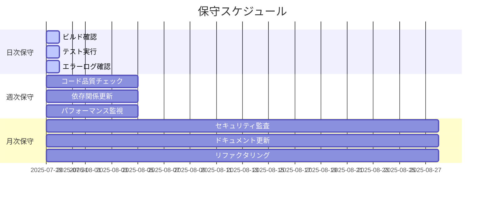

# 保守チェックリスト

> **最終更新**: 2025/07/29  
> **文書種別**: 正式仕様書  
> **更新頻度**: 月次

## 概要

本ドキュメントは、プロジェクトの継続的な品質維持と安定運用のための包括的なチェックリストです。日次、週次、月次の各保守作業と、コード品質・パフォーマンス・セキュリティの確認項目を体系的に整理しています。

## 保守スケジュール



## 日次保守作業

### ビルドとデプロイメント確認

```bash
# ビルド確認スクリプト
#!/bin/bash
# scripts/daily-build-check.sh

echo "🚀 日次ビルド確認開始..."

# 1. 依存関係の確認
echo "📦 依存関係チェック..."
pnpm audit --audit-level high
if [ $? -ne 0 ]; then
    echo "❌ 高リスクの脆弱性が発見されました"
    exit 1
fi

# 2. TypeScript型チェック
echo "🔍 型チェック..."
pnpm run type-check
if [ $? -ne 0 ]; then
    echo "❌ 型エラーが発見されました"
    exit 1
fi

# 3. Lintチェック
echo "🧹 Lintチェック..."
pnpm run lint
if [ $? -ne 0 ]; then
    echo "❌ Lintエラーが発見されました"
    exit 1
fi

# 4. ビルド確認
echo "🏗️ ビルド確認..."
pnpm run build
if [ $? -ne 0 ]; then
    echo "❌ ビルドが失敗しました"
    exit 1
fi

# 5. テスト実行
echo "🧪 テスト実行..."
pnpm run test:unit
if [ $? -ne 0 ]; then
    echo "❌ テストが失敗しました"
    exit 1
fi

echo "✅ 日次ビルド確認完了"
```

### チェックリスト

- [ ] **ビルド成功確認**
  ```bash
  pnpm run build
  ```

- [ ] **TypeScript型チェック**
  ```bash
  pnpm run type-check
  ```

- [ ] **Lintエラー確認**
  ```bash
  pnpm run lint
  ```

- [ ] **単体テスト実行**
  ```bash
  pnpm run test:unit
  ```

- [ ] **E2Eテスト実行**
  ```bash
  pnpm run test:e2e
  ```

- [ ] **GitHub Actions確認**
  - すべてのワークフローが成功しているか
  - デプロイメントが正常に完了しているか

- [ ] **エラーログ確認**
  ```bash
  # ログファイルの確認
  tail -n 100 logs/error.log
  grep -i error logs/application.log
  ```

- [ ] **パフォーマンス指標確認**
  - ページ読み込み時間
  - メモリ使用量
  - CPU使用率

## 週次保守作業

### コード品質チェック

```bash
# scripts/weekly-quality-check.sh
#!/bin/bash

echo "📊 週次コード品質チェック開始..."

# 1. コードカバレッジ確認
echo "📈 コードカバレッジ確認..."
pnpm run test:coverage
COVERAGE=$(grep -o 'Lines.*: [0-9.]*%' coverage/lcov-report/index.html | grep -o '[0-9.]*%')
echo "カバレッジ: $COVERAGE"

# 2. 複雑度チェック
echo "🔬 循環複雑度チェック..."
npx complexity-report --format json src/ > complexity-report.json

# 3. 重複コード検出
echo "👥 重複コード検出..."
npx jscpd src/

# 4. バンドルサイズ確認
echo "📦 バンドルサイズ確認..."
pnpm run build:analyze

echo "✅ 週次コード品質チェック完了"
```

### チェックリスト

- [ ] **コードカバレッジ確認**
  - 単体テスト: 85%以上
  - 統合テスト: 70%以上
  - E2Eテスト: 主要フロー100%

- [ ] **コード品質メトリクス**
  ```bash
  # SonarQubeでの品質確認
  sonar-scanner
  ```
  - 技術的負債比率: 5%以下
  - 循環複雑度: 平均10以下
  - 重複率: 3%以下

- [ ] **依存関係の更新**
  ```bash
  # 依存関係の確認と更新
  pnpm outdated
  pnpm update --latest
  ```

- [ ] **セキュリティスキャン**
  ```bash
  pnpm audit
  npm audit fix
  ```

- [ ] **パフォーマンステスト**
  ```bash
  # Lighthouseスコア確認
  pnpm run lighthouse
  ```
  - Performance: 90点以上
  - Accessibility: 100点
  - Best Practices: 100点
  - SEO: 90点以上

- [ ] **ブラウザ互換性確認**
  - Chrome (最新版)
  - Firefox (最新版)
  - Safari (最新版)
  - Edge (最新版)

## 月次保守作業

### セキュリティ監査

```bash
# scripts/monthly-security-audit.sh
#!/bin/bash

echo "🛡️ 月次セキュリティ監査開始..."

# 1. 依存関係の脆弱性チェック
echo "🔍 依存関係脆弱性スキャン..."
pnpm audit --json > security-audit.json

# 2. Semgrepによる静的解析
echo "🔬 静的セキュリティ解析..."
semgrep --config=auto src/

# 3. Gitシークレットスキャン
echo "🔐 シークレットスキャン..."
git-secrets --scan

# 4. CSPヘッダー確認
echo "🌐 CSPヘッダー確認..."
curl -I https://your-domain.com | grep -i content-security-policy

echo "✅ 月次セキュリティ監査完了"
```

### チェックリスト

- [ ] **セキュリティ監査**
  - [ ] 依存関係の脆弱性スキャン
  - [ ] 静的コード解析によるセキュリティチェック
  - [ ] Gitコミット履歴のシークレットスキャン
  - [ ] セキュリティヘッダーの確認

- [ ] **パフォーマンス最適化**
  - [ ] バンドルサイズの最適化
  - [ ] 画像最適化の確認
  - [ ] CDN設定の確認
  - [ ] キャッシュ戦略の見直し

- [ ] **ドキュメント更新**
  - [ ] README.mdの更新
  - [ ] CHANGELOG.mdの更新
  - [ ] API仕様書の更新
  - [ ] 開発ガイドの更新

- [ ] **アーキテクチャレビュー**
  - [ ] 設計パターンの一貫性確認
  - [ ] SOLID原則の遵守確認
  - [ ] DRY原則の遵守確認
  - [ ] 適切な抽象化レベルの確認

## コード品質チェックポイント

### TypeScript品質確認

```typescript
// コード品質チェック用のサンプル基準

// ✅ Good: 明確な型定義
interface UserProfile {
  readonly id: string
  readonly name: string
  readonly email: string
  readonly createdAt: Date
}

// ❌ Bad: any型の使用
function processData(data: any): any {
  return data
}

// ✅ Good: Result型を使用したエラーハンドリング
function validateEmail(email: string): Result<string> {
  if (!email.includes('@')) {
    return { success: false, error: 'Invalid email format' }
  }
  return { success: true, value: email }
}
```

### チェック項目

- [ ] **型安全性**
  - `any`型の使用を避ける
  - `unknown`型を適切に使用
  - 型ガードを実装する
  - 厳密なTypeScript設定を使用

- [ ] **関数の品質**
  - 単一責任の原則を守る
  - 純粋関数を優先する
  - 適切な引数の数（3個以下推奨）
  - 明確な関数名

- [ ] **クラス設計**
  - カプセル化を適切に実装
  - 継承よりコンポジションを優先
  - インターフェースに依存する
  - 不変性を保つ

- [ ] **エラーハンドリング**
  - Result型パターンの使用
  - 適切な例外処理
  - エラーメッセージの国際化対応
  - ログ出力の統一

## パフォーマンス監視項目

### フロントエンド性能監視

```javascript
// performance-monitor.js
class PerformanceMonitor {
  static measurePageLoad() {
    window.addEventListener('load', () => {
      const perfData = performance.getEntriesByType('navigation')[0]
      console.log('Page Load Metrics:', {
        domContentLoaded: perfData.domContentLoadedEventEnd - perfData.fetchStart,
        fullyLoaded: perfData.loadEventEnd - perfData.fetchStart,
        ttfb: perfData.responseStart - perfData.fetchStart
      })
    })
  }

  static measureFCP() {
    new PerformanceObserver((list) => {
      list.getEntries().forEach((entry) => {
        if (entry.name === 'first-contentful-paint') {
          console.log('FCP:', entry.startTime)
        }
      })
    }).observe({ entryTypes: ['paint'] })
  }

  static measureLCP() {
    new PerformanceObserver((list) => {
      list.getEntries().forEach((entry) => {
        console.log('LCP:', entry.startTime)
      })
    }).observe({ entryTypes: ['largest-contentful-paint'] })
  }
}
```

### チェック項目

- [ ] **Core Web Vitals**
  - LCP (Largest Contentful Paint): 2.5秒以下
  - FID (First Input Delay): 100ms以下
  - CLS (Cumulative Layout Shift): 0.1以下

- [ ] **リソース最適化**
  - バンドルサイズ: 1MB以下
  - 画像最適化: WebP形式使用
  - フォント最適化: WOFF2形式使用
  - CSS最適化: 未使用CSSの削除

- [ ] **ランタイム性能**
  - JavaScript実行時間: 50ms以下/タスク
  - メモリ使用量: 50MB以下
  - フレームレート: 60FPS維持
  - ガベージコレクション頻度: 適切な範囲

## セキュリティ確認事項

### セキュリティチェックリスト

- [ ] **認証・認可**
  - JWT トークンの適切な管理
  - セッション管理の実装
  - CSRF保護の実装
  - XSS対策の実装

- [ ] **データ保護**
  - 機密データの暗号化
  - パスワードのハッシュ化
  - SQLインジェクション対策
  - 入力値検証の実装

- [ ] **通信セキュリティ**
  - HTTPS通信の強制
  - セキュリティヘッダーの設定
  - CORS設定の確認
  - API認証の実装

- [ ] **フロントエンド固有**
  - Content Security Policy (CSP)
  - X-Frame-Options設定
  - X-Content-Type-Options設定
  - 機密情報のクライアント側保存回避

## 自動化スクリプト

### 統合チェックスクリプト

```bash
#!/bin/bash
# scripts/comprehensive-check.sh

echo "🔄 包括的システムチェック開始..."

FAILED_CHECKS=()

# 日次チェック実行
echo "📅 日次チェック実行中..."
if ! ./scripts/daily-build-check.sh; then
    FAILED_CHECKS+=("日次ビルドチェック")
fi

# 週次チェック実行（週の開始日のみ）
if [ $(date +%u) -eq 1 ]; then
    echo "📊 週次チェック実行中..."
    if ! ./scripts/weekly-quality-check.sh; then
        FAILED_CHECKS+=("週次品質チェック")
    fi
fi

# 月次チェック実行（月の初日のみ）
if [ $(date +%d) -eq 01 ]; then
    echo "🛡️ 月次チェック実行中..."
    if ! ./scripts/monthly-security-audit.sh; then
        FAILED_CHECKS+=("月次セキュリティ監査")
    fi
fi

# 結果レポート
if [ ${#FAILED_CHECKS[@]} -eq 0 ]; then
    echo "✅ すべてのチェックが成功しました"
    exit 0
else
    echo "❌ 以下のチェックが失敗しました:"
    printf '%s\n' "${FAILED_CHECKS[@]}"
    exit 1
fi
```

### GitHub Actions 統合

```yaml
# .github/workflows/maintenance.yml
name: Maintenance Check

on:
  schedule:
    - cron: '0 2 * * *'  # 毎日2時に実行
  workflow_dispatch:

jobs:
  daily-maintenance:
    runs-on: ubuntu-latest
    steps:
      - uses: actions/checkout@v4
      
      - name: Setup Node.js
        uses: actions/setup-node@v4
        with:
          node-version: '18'
          cache: 'pnpm'
      
      - name: Install dependencies
        run: pnpm install
      
      - name: Run maintenance checks
        run: ./scripts/comprehensive-check.sh
      
      - name: Upload reports
        uses: actions/upload-artifact@v4
        if: always()
        with:
          name: maintenance-reports
          path: |
            coverage/
            security-audit.json
            complexity-report.json
            lighthouse-report.html
```

## 品質メトリクス目標値

### コード品質目標

| メトリクス | 目標値 | 現在値 | 改善アクション |
|------------|--------|---------|----------------|
| テストカバレッジ | 85% | TBD | テスト追加 |
| 循環複雑度 | 平均10以下 | TBD | リファクタリング |
| 重複率 | 3%以下 | TBD | 共通化 |
| 技術的負債比率 | 5%以下 | TBD | 定期的な改善 |

### パフォーマンス目標

| メトリクス | 目標値 | 現在値 | 改善アクション |
|------------|--------|---------|----------------|
| LCP | 2.5秒以下 | TBD | 最適化 |
| FID | 100ms以下 | TBD | JS最適化 |
| CLS | 0.1以下 | TBD | レイアウト改善 |
| バンドルサイズ | 1MB以下 | TBD | コード分割 |

## 緊急時対応手順

### 重大なセキュリティ脆弱性発見時

1. **即座の対応**
   ```bash
   # 影響範囲の特定
   git log --grep="vulnerable-package"
   
   # 緊急パッチの適用
   pnpm update vulnerable-package
   
   # 緊急デプロイ
   pnpm run build && pnpm run deploy:emergency
   ```

2. **影響評価**
   - 脆弱性のCVSSスコア確認
   - 影響を受けるユーザー数の特定
   - データ漏洩の可能性評価

3. **事後対応**
   - インシデントレポートの作成
   - 再発防止策の実装
   - 監査ログの強化

### パフォーマンス劣化発見時

1. **原因特定**
   ```bash
   # パフォーマンス分析
   pnpm run analyze:bundle
   pnpm run profile:memory
   ```

2. **緊急対応**
   - CDNキャッシュのクリア
   - 問題のあるコードの一時的な無効化
   - スケールアップの実施

3. **根本対策**
   - ボトルネックの特定と修正
   - 監視体制の強化
   - アラート閾値の調整

## まとめ

本保守チェックリストは以下の目的を達成します：

1. **品質の維持**: 継続的な品質監視
2. **セキュリティの確保**: 定期的な脆弱性チェック
3. **パフォーマンスの最適化**: 性能劣化の早期発見
4. **技術的負債の管理**: 計画的なリファクタリング

定期的にこのチェックリストを実行し、結果を記録することで、プロジェクトの健全性を維持できます。また、自動化スクリプトを活用することで、保守作業の効率化と品質の標準化が実現できます。