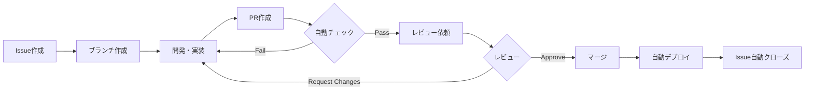

# Pull Request ワークフローガイド

> **最終更新**: 2025/01/31  
> **文書種別**: 開発ガイド  
> **更新頻度**: ワークフロー変更時に更新

## 📋 概要

このガイドでは、新しく導入されたPull Request（PR）ベースの開発フローについて説明します。

## 🔄 開発フローの概要



## 📝 ステップバイステップガイド

### 1. Issue作成

不具合や新機能の要望がある場合は、まずIssueを作成します。

```bash
# GitHub CLIを使用する場合
gh issue create

# またはWebインターフェースから作成
```

**Issueテンプレート**:
- **バグ報告**: 不具合の詳細と再現手順
- **機能要望**: 新機能の提案と背景

### 2. ブランチ作成

Issue番号を含むブランチ名を作成します。

```bash
# ブランチ命名規則: feature/[issue番号]-[簡潔な説明]
git checkout -b feature/16-pr-workflow

# バグ修正の場合: fix/[issue番号]-[簡潔な説明]
git checkout -b fix/123-navbar-crash
```

### 3. 開発・実装

通常通り開発を行い、定期的にコミットします。

```bash
# 変更をステージング
git add .

# コミット（conventional commitsを推奨）
git commit -m "feat: implement PR automated review workflow"
```

### 4. Pull Request作成

開発が完了したら、PRを作成します。

```bash
# ブランチをプッシュ
git push -u origin feature/16-pr-workflow

# GitHub CLIでPR作成
gh pr create --fill

# またはプッシュ後に表示されるURLからWebで作成
```

### 5. 自動チェック

PRを作成すると、以下の自動チェックが実行されます：

| チェック項目 | 内容 | 必須/参考 |
|------------|------|----------|
| ESLint | コード品質チェック | 必須 |
| TypeScript | 型チェック | 必須 |
| Unit Tests | テスト実行 | 必須 |
| Build | ビルド成功確認 | 必須 |
| Security | セキュリティ脆弱性スキャン | 参考 |
| Coverage | テストカバレッジ | 参考 |

### 6. レビュー対応

自動チェックが通ったら、レビューを依頼します。

```bash
# レビュアーを指定
gh pr edit --add-reviewer @username

# ラベルを追加
gh pr edit --add-label "ready for review"
```

### 7. マージ

レビューが承認されたら、マージします。

```bash
# Squash and merge（推奨）
gh pr merge --squash

# または通常のマージ
gh pr merge
```

## 🏷️ 自動ラベリング

PRで変更されたファイルに基づいて、自動的にラベルが付与されます：

- `frontend`: Vue/コンポーネント関連
- `backend`: ドメイン/ビジネスロジック関連
- `game`: ゲームロジック関連
- `tests`: テスト関連
- `documentation`: ドキュメント関連
- `configuration`: 設定ファイル関連
- `styles`: スタイル関連
- `performance`: パフォーマンス関連
- `security`: セキュリティ関連
- `dependencies`: 依存関係の更新

## ✅ PRチェックリスト

PR作成前に以下を確認してください：

- [ ] Issueが作成されている
- [ ] ブランチ名が規則に従っている
- [ ] コミットメッセージが明確
- [ ] テストが追加/更新されている
- [ ] ドキュメントが更新されている
- [ ] 自己レビューを実施した
- [ ] PRテンプレートを記入した

## 🚨 トラブルシューティング

### 自動チェックが失敗する場合

```bash
# ローカルで事前チェック
npm run lint
npm run type-check
npm run test:run
npm run build
```

### マージコンフリクトが発生した場合

```bash
# masterブランチを最新に更新
git checkout master
git pull origin master

# 作業ブランチに戻ってリベース
git checkout feature/your-branch
git rebase master

# コンフリクトを解決後
git add .
git rebase --continue
git push --force-with-lease
```

## 📚 参考リンク

- [GitHub Flow](https://docs.github.com/en/get-started/quickstart/github-flow)
- [Conventional Commits](https://www.conventionalcommits.org/)
- [Issue完了ガイドライン](./ISSUE_COMPLETION_GUIDE.md)

## 🎯 ベストプラクティス

1. **小さなPRを心がける**: レビューしやすい適切なサイズに
2. **明確な説明を書く**: 何を、なぜ変更したのかを明記
3. **テストを含める**: 新機能には必ずテストを追加
4. **レビューに迅速に対応**: フィードバックには素早く対応
5. **ドキュメントを更新**: コードと同時にドキュメントも更新

---

このワークフローに従うことで、高品質なコードベースを維持しながら、効率的な開発が可能になります。