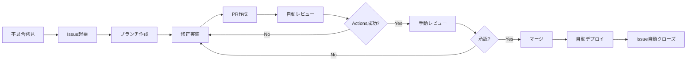

# Pull Request ワークフロー導入計画

> **最終更新**: 2025/01/31  
> **文書種別**: 実装計画書  
> **更新頻度**: 実装完了後は参照用

## 📋 概要

プロフェッショナルな開発フローを導入し、コード品質とプロジェクトの安定性を向上させるための実装計画です。

## 🎯 目標

1. **品質保証**: すべてのコード変更が自動レビューを通過
2. **トレーサビリティ**: Issue → PR → レビュー → マージの流れを確立
3. **自動化**: 人的ミスを削減し、開発効率を向上
4. **協調開発**: 複数人での開発が可能な環境構築

## 🔄 新しい開発フロー



## 📝 実装タスク

### Phase 1: 基盤整備（即日実装）

#### 1.1 ブランチ保護ルール設定
```yaml
# master ブランチの保護設定
- 直接プッシュの禁止
- PRの必須化
- レビュー承認の必須化（1人以上）
- 最新ブランチの要求
- ステータスチェックの必須化
```

#### 1.2 GitHub Actions - PR自動レビュー
```yaml
# .github/workflows/pr-review.yml
name: PR Automated Review

on:
  pull_request:
    types: [opened, synchronize, reopened]

jobs:
  # Lintチェック
  lint:
    name: ESLint Check
    runs-on: ubuntu-latest
    steps:
      - uses: actions/checkout@v4
      - uses: actions/setup-node@v4
        with:
          node-version: '20'
      - run: npm ci
      - run: npm run lint
      
  # 型チェック
  type-check:
    name: TypeScript Check
    runs-on: ubuntu-latest
    steps:
      - uses: actions/checkout@v4
      - uses: actions/setup-node@v4
        with:
          node-version: '20'
      - run: npm ci
      - run: npm run type-check
      
  # テスト実行
  test:
    name: Unit Tests
    runs-on: ubuntu-latest
    steps:
      - uses: actions/checkout@v4
      - uses: actions/setup-node@v4
        with:
          node-version: '20'
      - run: npm ci
      - run: npm run test:run
      
  # ビルドチェック
  build:
    name: Build Check
    runs-on: ubuntu-latest
    steps:
      - uses: actions/checkout@v4
      - uses: actions/setup-node@v4
        with:
          node-version: '20'
      - run: npm ci
      - run: npm run build
      
  # セキュリティスキャン
  security:
    name: Security Scan
    runs-on: ubuntu-latest
    steps:
      - uses: actions/checkout@v4
      - run: npm audit --audit-level=moderate
```

#### 1.3 PR自動コメント機能
```yaml
# .github/workflows/pr-comment.yml
name: PR Status Comment

on:
  pull_request:
    types: [opened]
  workflow_run:
    workflows: ["PR Automated Review"]
    types: [completed]

jobs:
  comment:
    runs-on: ubuntu-latest
    steps:
      - uses: actions/github-script@v7
        with:
          script: |
            const { data: checks } = await github.rest.checks.listForRef({
              owner: context.repo.owner,
              repo: context.repo.repo,
              ref: context.payload.pull_request.head.sha
            });
            
            let comment = '## 🤖 自動レビュー結果\n\n';
            comment += '| チェック項目 | 状態 | 詳細 |\n';
            comment += '|---|---|---|\n';
            
            // 各チェックの結果を表示
            checks.check_runs.forEach(check => {
              const status = check.conclusion === 'success' ? '✅' : '❌';
              comment += `| ${check.name} | ${status} | ${check.status} |\n`;
            });
            
            github.rest.issues.createComment({
              owner: context.repo.owner,
              repo: context.repo.repo,
              issue_number: context.payload.pull_request.number,
              body: comment
            });
```

### Phase 2: テンプレート整備（Day 2）

#### 2.1 Issueテンプレート
```markdown
# .github/ISSUE_TEMPLATE/bug_report.md
---
name: バグ報告
about: 不具合を報告する
title: '[BUG] '
labels: 'bug'
assignees: ''
---

## 概要
<!-- 不具合の簡潔な説明 -->

## 再現手順
1. 
2. 
3. 

## 期待される動作

## 実際の動作

## スクリーンショット
<!-- 可能であれば添付 -->

## 環境
- OS: 
- ブラウザ: 
- バージョン: 

## 追加情報
```

```markdown
# .github/ISSUE_TEMPLATE/feature_request.md
---
name: 機能要望
about: 新機能を提案する
title: '[FEATURE] '
labels: 'enhancement'
assignees: ''
---

## 概要
<!-- 機能の簡潔な説明 -->

## 背景・動機

## 提案する解決策

## 代替案

## 追加情報
```

#### 2.2 PRテンプレート
```markdown
# .github/pull_request_template.md
## 概要
<!-- 変更の簡潔な説明 -->

## 関連Issue
Fixes #<!-- Issue番号 -->

## 変更内容
- [ ] 
- [ ] 
- [ ] 

## テスト
- [ ] ユニットテストを追加/更新した
- [ ] ローカルで動作確認した
- [ ] ドキュメントを更新した

## レビューポイント
<!-- レビュアーに特に見てほしい箇所 -->

## スクリーンショット
<!-- UI変更がある場合は必須 -->

## チェックリスト
- [ ] コードは自己レビュー済み
- [ ] 変更はPRの目的に合致している
- [ ] 不要なコメントやデバッグコードは削除した
- [ ] セキュリティを考慮した実装になっている
```

### Phase 3: 高度な自動化（Day 3）

#### 3.1 自動ラベリング
```yaml
# .github/labeler.yml
frontend:
  - src/components/**/*
  - src/App.vue
  
backend:
  - src/domain/**/*
  - src/application/**/*
  
tests:
  - src/__tests__/**/*
  - '**/*.test.ts'
  
documentation:
  - docs/**/*
  - README.md
```

#### 3.2 PR サイズチェッカー
```yaml
# .github/workflows/pr-size.yml
name: PR Size Check

on: pull_request

jobs:
  size-check:
    runs-on: ubuntu-latest
    steps:
      - uses: actions/checkout@v4
      - uses: actions/github-script@v7
        with:
          script: |
            const { data: pr } = await github.rest.pulls.get({
              owner: context.repo.owner,
              repo: context.repo.repo,
              pull_number: context.issue.number
            });
            
            if (pr.additions + pr.deletions > 500) {
              await github.rest.issues.createComment({
                owner: context.repo.owner,
                repo: context.repo.repo,
                issue_number: context.issue.number,
                body: '⚠️ このPRは500行を超える変更を含んでいます。レビューしやすいサイズに分割することを検討してください。'
              });
            }
```

#### 3.3 自動マージ機能
```yaml
# .github/workflows/auto-merge.yml
name: Auto Merge

on:
  pull_request_review:
    types: [submitted]
  check_suite:
    types: [completed]

jobs:
  auto-merge:
    runs-on: ubuntu-latest
    if: github.event.review.state == 'approved'
    steps:
      - uses: pascalgn/merge-action@v0.1.4
        env:
          GITHUB_TOKEN: ${{ secrets.GITHUB_TOKEN }}
          MERGE_LABELS: "auto-merge,!do-not-merge"
          MERGE_METHOD: "squash"
          MERGE_COMMIT_MESSAGE: "pull-request-title"
```

### Phase 4: 開発者体験向上（Week 2）

#### 4.1 ローカル開発支援
```json
// .vscode/settings.json
{
  "git.branchProtection": true,
  "git.requireGitUserConfig": true,
  "files.autoSave": "onFocusChange",
  "editor.formatOnSave": true,
  "editor.codeActionsOnSave": {
    "source.fixAll.eslint": true
  }
}
```

#### 4.2 Pre-commit強化
```yaml
# .husky/prepare-commit-msg
#!/bin/sh
. "$(dirname "$0")/_/husky.sh"

# Issue番号を自動でコミットメッセージに追加
BRANCH_NAME=$(git symbolic-ref --short HEAD)
ISSUE_NUMBER=$(echo $BRANCH_NAME | grep -o '[0-9]\+')

if [ -n "$ISSUE_NUMBER" ]; then
  echo "\n\nIssue #$ISSUE_NUMBER" >> $1
fi
```

## 📊 成功指標

### 定量的指標
- PR平均レビュー時間: < 2時間
- 自動チェック合格率: > 90%
- バグ混入率: < 5%
- デプロイ成功率: > 95%

### 定性的指標
- 開発者満足度の向上
- コードレビューの質向上
- ドキュメントの充実
- チーム協調の改善

## 🚀 実装スケジュール

| フェーズ | 期間 | 主なタスク |
|---------|------|------------|
| Phase 1 | Day 1 | ブランチ保護、基本Actions |
| Phase 2 | Day 2 | テンプレート整備 |
| Phase 3 | Day 3-5 | 高度な自動化 |
| Phase 4 | Week 2 | 開発者体験向上 |

## 📚 参考資料

- [GitHub Actions ドキュメント](https://docs.github.com/actions)
- [Branch protection rules](https://docs.github.com/repositories/configuring-branches-and-merges-in-your-repository/defining-the-mergeability-of-pull-requests/about-protected-branches)
- [PR best practices](https://docs.github.com/pull-requests/collaborating-with-pull-requests/getting-started/best-practices-for-pull-requests)

## ✅ 導入後の運用

1. **定期レビュー**: 月1回ワークフローの改善点を検討
2. **メトリクス収集**: PR統計を収集し、改善に活用
3. **フィードバック**: 開発者からの意見を積極的に取り入れ
4. **継続的改善**: 新しいツールや手法を評価・導入

---

この計画に従って実装を進めることで、プロフェッショナルな開発環境を構築できます。