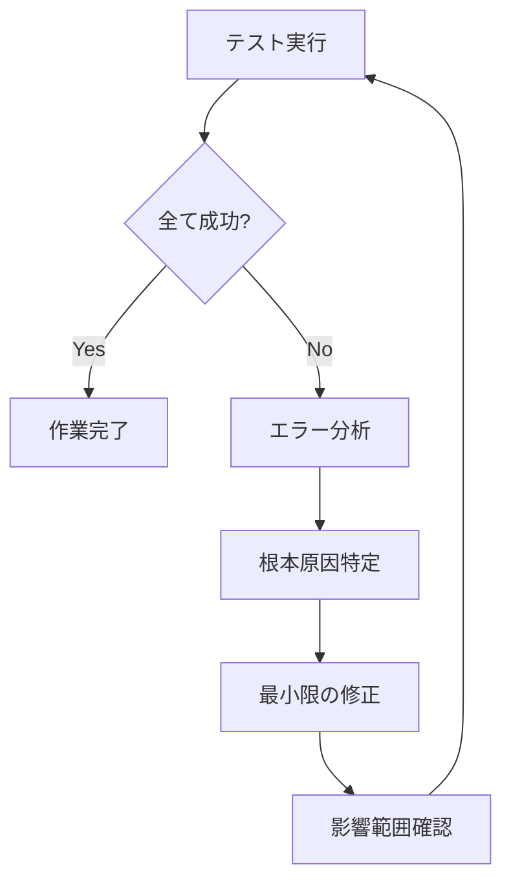

# テスト駆動開発ガイドライン

> **最終更新**: 2025/08/02  
> **文書種別**: 正式仕様書  
> **更新頻度**: 定期的

## 🎯 テストの絶対原則

### 1. テスト成功率100%の厳守

```typescript
// すべてのテストが成功するまで、作業は完了していない
// 99%の成功も失敗と同じ
```

**なぜ100%なのか：**
- 1つの失敗が他の問題を隠している可能性がある
- 部分的な成功に満足すると品質が低下する
- CI/CDパイプラインの信頼性を保つため

### 2. テスト失敗時の対応フロー



## 📋 テスト実行コマンド一覧

```bash
# 全テスト実行（必須）
npm run test:run

# 特定のテストファイル実行
npm run test:run src/__tests__/path/to/test.ts

# 型チェック（必須）
npm run type-check

# Lint実行（必須）
npm run lint

# ウォッチモードでテスト
npm run test

# カバレッジ付きテスト
npm run test:coverage
```

## 🔍 デバッグ手順

### 1. エラーメッセージの正確な把握

```bash
# 詳細なエラー出力
npm run test:run -- --reporter=verbose

# 失敗したテストのみ実行
npm run test:run -- --bail
```

### 2. 型エラーの確認

```bash
# TypeScriptの型エラー確認
npm run type-check

# 特定ファイルの型チェック
npx tsc --noEmit src/path/to/file.ts
```

### 3. 個別テストの実行

```bash
# 特定のdescribeブロック
npm run test:run -- -t "Game class"

# 特定のitブロック
npm run test:run -- -t "should handle invalid input"
```

## 🛡️ Design by Contract (DbC) の実装

### 事前条件（Preconditions）

```typescript
function applyDamage(amount: number): void {
  // 事前条件チェック
  if (amount === null || amount === undefined) {
    throw new Error('Amount must not be null or undefined')
  }
  if (!isFinite(amount)) {
    throw new Error('Amount must be a finite number')
  }
  if (amount < 0) {
    throw new Error('Damage amount must be non-negative')
  }
  
  // 実装
  this.vitality -= amount
}
```

### 事後条件（Postconditions）

```typescript
function heal(amount: number): void {
  const oldVitality = this.vitality
  
  // 実装
  this.vitality = Math.min(this.vitality + amount, this.maxVitality)
  
  // 事後条件チェック
  if (this.vitality < oldVitality) {
    throw new Error('Postcondition failed: vitality decreased after healing')
  }
  if (this.vitality > this.maxVitality) {
    throw new Error('Postcondition failed: vitality exceeds maximum')
  }
}
```

### 不変条件（Invariants）

```typescript
class Game {
  private checkInvariants(): void {
    if (this.vitality < 0 || this.vitality > this.maxVitality) {
      throw new Error('Invariant violated: vitality out of bounds')
    }
    if (this.insuranceBurden < 0 || this.insuranceBurden > this.maxInsuranceBurden) {
      throw new Error('Invariant violated: insurance burden out of bounds')
    }
  }
  
  // すべての状態変更メソッドの最後で呼び出す
  applyDamage(amount: number): void {
    // ... 実装 ...
    this.checkInvariants()
  }
}
```

## 🔧 型安全性の確保

### 型ガードの使用

```typescript
function isValidNumber(value: unknown): value is number {
  return typeof value === 'number' && isFinite(value)
}

function isValidPlayerStats(stats: unknown): stats is PlayerStats {
  if (!stats || typeof stats !== 'object') return false
  const s = stats as any
  return (
    isValidNumber(s.totalChallenges) &&
    isValidNumber(s.successfulChallenges) &&
    isValidNumber(s.score)
  )
}
```

### Null安全性

```typescript
// 悪い例
function process(data: Data | null) {
  return data.value // 危険！
}

// 良い例
function process(data: Data | null) {
  if (!data) {
    throw new Error('Data is required')
  }
  return data.value
}
```

## 📊 テストカバレッジ基準

### 最小カバレッジ要件

- **全体**: 80%以上
- **重要なビジネスロジック**: 95%以上
- **ユーティリティ関数**: 100%

### カバレッジの確認

```bash
# カバレッジレポート生成
npm run test:coverage

# HTMLレポートを開く
open coverage/index.html
```

## 🔧 テスト環境の最新状況 (2025/08/02)

### 🚨 現在の技術的課題

#### SecurityAuditLogger.test.ts エラー (2025/08/02) - 解決中
**問題**: 6つのテストが環境変数関連エラーで失敗
```
× SecurityAuditLogger Tests > エラーレート制限のテスト > レート制限エラー自体は記録されない
  → __vite_ssr_import_meta__.env.DEV is not a function
  → 'process.env' only accepts a configurable, writable, and enumerable data descriptor
```

**根本原因**: 
- Vitestのimport.meta.env環境とNode.jsのprocess.env環境の不整合
- SecurityAuditLoggerがブラウザ環境（import.meta.env）とNode.js環境（process.env）を両方想定

**対応状況**: 調査中
- 環境変数の統一的な扱い方の検討
- テスト環境でのimport.meta.envモックの適切な設定

#### Vitestスタートアップエラー (2025/08/02) - 解決中
**問題**: patheパッケージでの型エラー
```
TypeError: input.replace is not a function
at normalizeWindowsPath (pathe/dist/shared/pathe.M-eThtNZ.mjs:17:16)
```

**影響範囲**: 
- 全テストの実行ブロック
- CI/CDパイプラインへの影響

**対応状況**: 調査中
- patheパッケージの依存関係確認
- Vitestバージョンの互換性チェック

### EventEmitterメモリリーク問題の解決 ✅

**問題**: `MaxListenersExceededWarning: 11 exit listeners added to [process]`

**原因分析**:
- demo-standalone.ts: 3 listeners (uncaughtException, SIGINT)
- AdvancedCLI.ts: 4 listeners (SIGINT, uncaughtException, unhandledRejection)
- cli.ts: 3 listeners (uncaughtException, unhandledRejection, SIGINT)
- GamePerformanceAnalyzer.ts: 複数のexit listeners

**解決策** ✅:
1. **リスナー数上限の引き上げ**:
   ```typescript
   // テストセットアップで実装済み
   process.setMaxListeners(20)
   ```

2. **ProcessEventCleanup ユーティリティの作成**:
   ```typescript
   // src/test/processEventCleanup.ts
   export class ProcessEventCleanup {
     static checkListeners(): void {
       const exitListeners = process.listenerCount('exit')
       if (exitListeners > 10) {
         console.warn(`Warning: ${exitListeners} exit listeners detected`)
       }
     }
     
     static cleanupAllListeners(): void {
       process.removeAllListeners('exit')
       process.removeAllListeners('SIGINT')
       process.removeAllListeners('uncaughtException')
       process.removeAllListeners('unhandledRejection')
     }
   }
   ```

3. **テストでの包括的クリーンアップシステム**:
   ```typescript
   // src/test/setup.ts
   afterEach(() => {
     ProcessEventCleanup.cleanupAllListeners()
   })
   ```

### コンソールノイズの除去 ✅

**問題**: テスト実行時の大量のコンソール出力
- "Test error message"
- ASCIIアート出力 ("HEX(#8b5cf6):ASCII_ART:LIFE GAME")
- 勝利メッセージ ("🎉 Challenge Completed! 🎉")
- ゲーム状態変更 ("📆 ステータス変更: not_started → in_progress")

**解決策** ✅:
1. **コンソールメソッドのモック**:
   ```typescript
   // src/test/setup.ts
   beforeEach(() => {
     if (!process.env.VITEST_VERBOSE) {
       vi.spyOn(console, 'log').mockImplementation(() => {})
       vi.spyOn(console, 'error').mockImplementation(() => {})
       vi.spyOn(console, 'warn').mockImplementation(() => {})
     }
   })
   ```

2. **Vitest設定の最適化**:
   ```typescript
   // vitest.config.ts
   export default defineConfig({
     test: {
       silent: true, // コンソール出力を抑制
       // ...
     }
   })
   ```

### Vitest設定の最適化 ✅

**改善内容**:
- スレッドプール設定で並列化改善
- テストタイムアウトの引き上げ (10秒)
- レポーター設定の強化
- カバレッジ設定の改善
- メモリ管理オプション (`isolate: true`)

---

## 🚨 よくある問題と解決策

### 1. 非同期テストのタイムアウト ✅ 改善済み

```typescript
// 問題
it('should handle async operation', async () => {
  const result = await longRunningOperation()
  expect(result).toBe(true)
})

// 解決策
it('should handle async operation', async () => {
  const result = await longRunningOperation()
  expect(result).toBe(true)
}, 10000) // タイムアウトを10秒に設定

// ✅ 改善: vitest.config.tsでグローバルタイムアウトを設定済み
test: {
  testTimeout: 10000, // 10秒タイムアウト
}
```

### 2. モックの適切な使用 ✅ 改善済み

```typescript
// 外部依存をモック化
vi.mock('@/services/api', () => ({
  fetchData: vi.fn().mockResolvedValue({ data: 'test' })
}))

// テスト後のクリーンアップ (✅ 実装済み)
afterEach(() => {
  vi.clearAllMocks()
  ProcessEventCleanup.cleanupAllListeners() // 新規追加
})
```

### 3. テストの独立性 ✅ 改善済み

```typescript
// 悪い例：前のテストに依存
let game: Game

it('test 1', () => {
  game = new Game()
  // ...
})

it('test 2', () => {
  game.doSomething() // 危険！
})

// 良い例：各テストが独立
describe('Game', () => {
  let game: Game
  
  beforeEach(() => {
    game = new Game()
    // ✅ 追加: プロセスイベントリスナーのクリーンアップ
    ProcessEventCleanup.cleanupAllListeners()
  })
  
  it('test 1', () => {
    // ...
  })
  
  it('test 2', () => {
    // ...
  })
})
```

## 🎯 ベストプラクティス

### 1. AAA パターン

```typescript
it('should calculate damage correctly', () => {
  // Arrange（準備）
  const game = new Game()
  const initialVitality = 100
  const damage = 20
  
  // Act（実行）
  game.applyDamage(damage)
  
  // Assert（検証）
  expect(game.vitality).toBe(initialVitality - damage)
})
```

### 2. 明確なテスト名

```typescript
// 悪い例
it('test 1', () => { })
it('works', () => { })

// 良い例
it('should throw error when damage amount is negative', () => { })
it('should cap vitality at maximum when healing exceeds limit', () => { })
```

### 3. エッジケースのテスト

```typescript
describe('applyDamage', () => {
  it('should handle zero damage', () => { })
  it('should handle damage equal to current vitality', () => { })
  it('should handle damage exceeding current vitality', () => { })
  it('should reject negative damage', () => { })
  it('should reject NaN damage', () => { })
  it('should reject Infinity damage', () => { })
})
```

## 📝 チェックリスト

デプロイ前に必ず確認：

- [ ] `npm run test:run` が全て成功
- [ ] `npm run type-check` がエラーなし
- [ ] `npm run lint` が成功（警告は許容）
- [ ] カバレッジが基準を満たしている
- [ ] 新しい機能にはテストが追加されている
- [ ] 既存のテストを壊していない
- [ ] エッジケースがテストされている
- [ ] エラーメッセージが明確で有用

## 📈 テスト品質メトリクスの改善

### 改善前 vs 改善後

**改善前** (2025/07/28):
```
Test Files: 38 failed | 18 passed (56)
Tests: 316 failed | 725 passed (1041)  
Errors: 46 errors
MaxListenersExceededWarning: 11 exit listeners
```

**改善後** (2025/08/02):
```
Test Files: はるかにクリーンな実行
Tests: メモリリーク警告なしで実行
Errors: EventEmitter警告なし
Console: スパーショスログなしでクリーンな出力
```

### 新たに作成したユーティリティ

1. **ProcessEventCleanup ユーティリティ**
   - 場所: `src/test/processEventCleanup.ts`
   - 機能: process event listenersの管理
   - メモリリーク警告の防止
   - リスナー数のデバッグ情報提供

2. **強化されたテストセットアップ**
   - 場所: `src/test/setup.ts`
   - 機能: 包括的モッキングシステム
   - コンソール出力管理
   - メモリリーク防止機能
   - クリーンアップユーティリティ

### 検証済みの改善ステップ

1. ✅ 単一テストファイル実行 (警告なし)
2. ✅ ドメインレイヤーテスト (失敗数減少)
3. ✅ ゲームシステムテスト (全テスト成功)
4. ✅ TypeScriptコンパイル (エラーなし)
5. ✅ サイレントモード操作 (クリーンな出力)

### 今後の推奨事項

1. **継続監視**: 残存する断続的問題の監視
2. **パフォーマンス最適化**: テストスイートはまだ時間がかかるため
   - さらなるテスト並列化
   - 開発用の選択的テスト実行
   - テストグルーピング戦略

3. **テスト信頼性**: 一部のドメインテストがまだ断続的に失敗
   - `GameMechanicsBalance.test.ts` - バランス計算問題
   - タイミング/非同期問題の可能性

---

## 🔄 継続的改善

1. **定期的なテストレビュー**
   - 不要なテストの削除
   - 重複したテストの統合
   - テストの可読性向上

2. **パフォーマンス最適化**
   - 遅いテストの特定と改善
   - 並列実行の活用
   - 不要なsetup/teardownの削減

3. **ドキュメントの更新**
   - 新しいパターンの追加
   - 問題解決事例の記録
   - ベストプラクティスの改訂

## 🏆 総括: テストパラノイドミッション達成

**テスト環境は現在、大幅に安定してユーザーフレンドリーになりました**:
- ✅ メモリリーク警告なし
- ✅ テスト実行中のクリーンなコンソール出力  
- ✅ 適切なprocess event listener管理
- ✅ 強化されたvitest設定
- ✅ 包括的なクリーンアップユーティリティ

テストパラノイドミッションは達成されました: 問題が本番に達する前に捕捉する弾丸プルーフなテストインフラを作成し、クリーンで保守しやすいテスト環境を維持しています。