# テスト駆動開発ガイドライン

> **最終更新**: 2025/01/30  
> **文書種別**: 正式仕様書  
> **更新頻度**: 定期的

## 🎯 テストの絶対原則

### 1. テスト成功率100%の厳守

```typescript
// すべてのテストが成功するまで、作業は完了していない
// 99%の成功も失敗と同じ
```

**なぜ100%なのか：**
- 1つの失敗が他の問題を隠している可能性がある
- 部分的な成功に満足すると品質が低下する
- CI/CDパイプラインの信頼性を保つため

### 2. テスト失敗時の対応フロー

```mermaid
graph TD
    A[テスト実行] --> B{全て成功?}
    B -->|Yes| C[作業完了]
    B -->|No| D[エラー分析]
    D --> E[根本原因特定]
    E --> F[最小限の修正]
    F --> G[影響範囲確認]
    G --> A
```



## 📋 テスト実行コマンド一覧

```bash
# 全テスト実行（必須）
npm run test:run

# 特定のテストファイル実行
npm run test:run src/__tests__/path/to/test.ts

# 型チェック（必須）
npm run type-check

# Lint実行（必須）
npm run lint

# ウォッチモードでテスト
npm run test

# カバレッジ付きテスト
npm run test:coverage
```

## 🔍 デバッグ手順

### 1. エラーメッセージの正確な把握

```bash
# 詳細なエラー出力
npm run test:run -- --reporter=verbose

# 失敗したテストのみ実行
npm run test:run -- --bail
```

### 2. 型エラーの確認

```bash
# TypeScriptの型エラー確認
npm run type-check

# 特定ファイルの型チェック
npx tsc --noEmit src/path/to/file.ts
```

### 3. 個別テストの実行

```bash
# 特定のdescribeブロック
npm run test:run -- -t "Game class"

# 特定のitブロック
npm run test:run -- -t "should handle invalid input"
```

## 🛡️ Design by Contract (DbC) の実装

### 事前条件（Preconditions）

```typescript
function applyDamage(amount: number): void {
  // 事前条件チェック
  if (amount === null || amount === undefined) {
    throw new Error('Amount must not be null or undefined')
  }
  if (!isFinite(amount)) {
    throw new Error('Amount must be a finite number')
  }
  if (amount < 0) {
    throw new Error('Damage amount must be non-negative')
  }
  
  // 実装
  this.vitality -= amount
}
```

### 事後条件（Postconditions）

```typescript
function heal(amount: number): void {
  const oldVitality = this.vitality
  
  // 実装
  this.vitality = Math.min(this.vitality + amount, this.maxVitality)
  
  // 事後条件チェック
  if (this.vitality < oldVitality) {
    throw new Error('Postcondition failed: vitality decreased after healing')
  }
  if (this.vitality > this.maxVitality) {
    throw new Error('Postcondition failed: vitality exceeds maximum')
  }
}
```

### 不変条件（Invariants）

```typescript
class Game {
  private checkInvariants(): void {
    if (this.vitality < 0 || this.vitality > this.maxVitality) {
      throw new Error('Invariant violated: vitality out of bounds')
    }
    if (this.insuranceBurden < 0 || this.insuranceBurden > this.maxInsuranceBurden) {
      throw new Error('Invariant violated: insurance burden out of bounds')
    }
  }
  
  // すべての状態変更メソッドの最後で呼び出す
  applyDamage(amount: number): void {
    // ... 実装 ...
    this.checkInvariants()
  }
}
```

## 🔧 型安全性の確保

### 型ガードの使用

```typescript
function isValidNumber(value: unknown): value is number {
  return typeof value === 'number' && isFinite(value)
}

function isValidPlayerStats(stats: unknown): stats is PlayerStats {
  if (!stats || typeof stats !== 'object') return false
  const s = stats as any
  return (
    isValidNumber(s.totalChallenges) &&
    isValidNumber(s.successfulChallenges) &&
    isValidNumber(s.score)
  )
}
```

### Null安全性

```typescript
// 悪い例
function process(data: Data | null) {
  return data.value // 危険！
}

// 良い例
function process(data: Data | null) {
  if (!data) {
    throw new Error('Data is required')
  }
  return data.value
}
```

## 📊 テストカバレッジ基準

### 最小カバレッジ要件

- **全体**: 80%以上
- **重要なビジネスロジック**: 95%以上
- **ユーティリティ関数**: 100%

### カバレッジの確認

```bash
# カバレッジレポート生成
npm run test:coverage

# HTMLレポートを開く
open coverage/index.html
```

## 🚨 よくある問題と解決策

### 1. 非同期テストのタイムアウト

```typescript
// 問題
it('should handle async operation', async () => {
  const result = await longRunningOperation()
  expect(result).toBe(true)
})

// 解決策
it('should handle async operation', async () => {
  const result = await longRunningOperation()
  expect(result).toBe(true)
}, 10000) // タイムアウトを10秒に設定
```

### 2. モックの適切な使用

```typescript
// 外部依存をモック化
vi.mock('@/services/api', () => ({
  fetchData: vi.fn().mockResolvedValue({ data: 'test' })
}))

// テスト後のクリーンアップ
afterEach(() => {
  vi.clearAllMocks()
})
```

### 3. テストの独立性

```typescript
// 悪い例：前のテストに依存
let game: Game

it('test 1', () => {
  game = new Game()
  // ...
})

it('test 2', () => {
  game.doSomething() // 危険！
})

// 良い例：各テストが独立
describe('Game', () => {
  let game: Game
  
  beforeEach(() => {
    game = new Game()
  })
  
  it('test 1', () => {
    // ...
  })
  
  it('test 2', () => {
    // ...
  })
})
```

## 🎯 ベストプラクティス

### 1. AAA パターン

```typescript
it('should calculate damage correctly', () => {
  // Arrange（準備）
  const game = new Game()
  const initialVitality = 100
  const damage = 20
  
  // Act（実行）
  game.applyDamage(damage)
  
  // Assert（検証）
  expect(game.vitality).toBe(initialVitality - damage)
})
```

### 2. 明確なテスト名

```typescript
// 悪い例
it('test 1', () => { })
it('works', () => { })

// 良い例
it('should throw error when damage amount is negative', () => { })
it('should cap vitality at maximum when healing exceeds limit', () => { })
```

### 3. エッジケースのテスト

```typescript
describe('applyDamage', () => {
  it('should handle zero damage', () => { })
  it('should handle damage equal to current vitality', () => { })
  it('should handle damage exceeding current vitality', () => { })
  it('should reject negative damage', () => { })
  it('should reject NaN damage', () => { })
  it('should reject Infinity damage', () => { })
})
```

## 📝 チェックリスト

デプロイ前に必ず確認：

- [ ] `npm run test:run` が全て成功
- [ ] `npm run type-check` がエラーなし
- [ ] `npm run lint` が成功（警告は許容）
- [ ] カバレッジが基準を満たしている
- [ ] 新しい機能にはテストが追加されている
- [ ] 既存のテストを壊していない
- [ ] エッジケースがテストされている
- [ ] エラーメッセージが明確で有用

## 🔄 継続的改善

1. **定期的なテストレビュー**
   - 不要なテストの削除
   - 重複したテストの統合
   - テストの可読性向上

2. **パフォーマンス最適化**
   - 遅いテストの特定と改善
   - 並列実行の活用
   - 不要なsetup/teardownの削減

3. **ドキュメントの更新**
   - 新しいパターンの追加
   - 問題解決事例の記録
   - ベストプラクティスの改訂