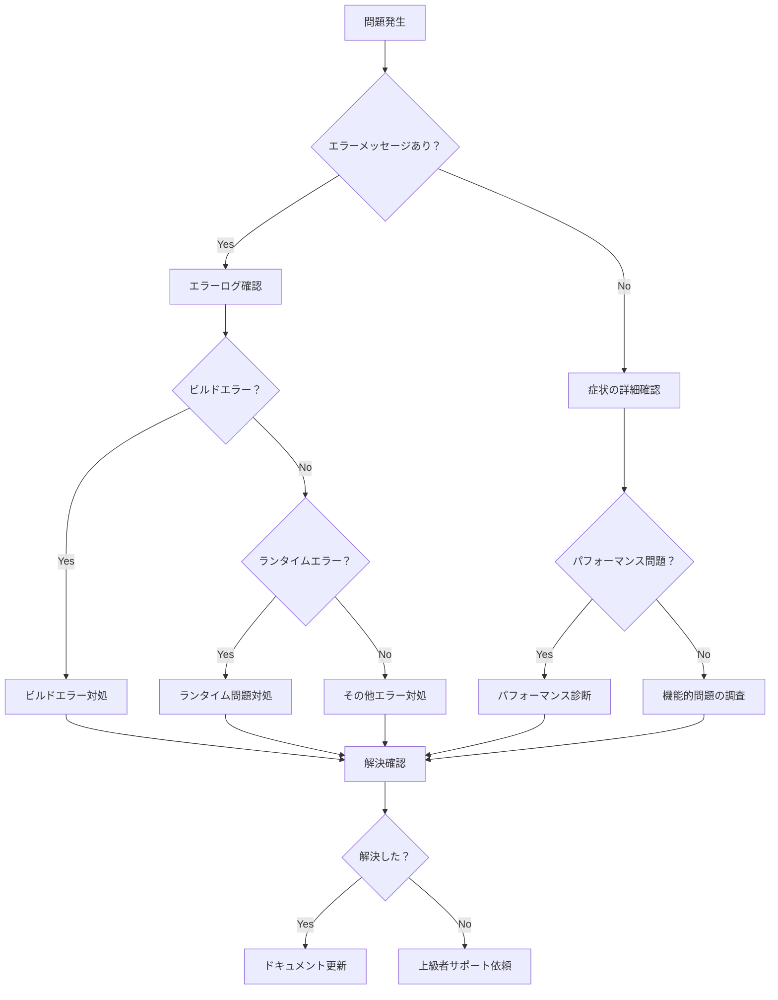

# トラブルシューティングガイド

> **最終更新**: 2025/07/29  
> **文書種別**: 正式仕様書  
> **更新頻度**: 問題発生時

## 概要

本ドキュメントは、開発・運用時に発生する可能性のある問題と、その診断・解決方法を体系的に整理したトラブルシューティングガイドです。問題の迅速な解決と、類似問題の予防に役立てることを目的としています。

## 問題カテゴリ別索引

1. [開発環境問題](#開発環境問題)
2. [ビルドエラー](#ビルドエラー)
3. [型エラー](#型エラー)
4. [ランタイムエラー](#ランタイムエラー)
5. [パフォーマンス問題](#パフォーマンス問題)
6. [デプロイ問題](#デプロイ問題)
7. [ブラウザ固有問題](#ブラウザ固有問題)
8. [プラグインシステム問題](#プラグインシステム問題)

## 問題診断フローチャート



## 開発環境問題

### Claude Code起動問題

#### 問題: Claude Codeが起動しない

**症状**: Claude Codeの起動コマンドが失敗する

**診断手順**:
```bash
# Node.js バージョン確認
node --version

# npmrc 設定確認
cat ~/.npmrc

# Claude Code インストール確認
npm list -g | grep claude
```

**解決方法**:

1. **npmrcファイルの問題**
   ```bash
   # 問題のある .npmrc を削除
   rm ~/.npmrc
   
   # Claude Code再インストール
   npm install -g @anthropic/claude-cli
   ```

2. **Node.js バージョン問題**
   ```bash
   # Node.js 18以上に更新
   nvm install 18
   nvm use 18
   ```

3. **権限問題**
   ```bash
   # npm global prefix確認
   npm config get prefix
   
   # 権限修正
   sudo chown -R $(whoami) $(npm config get prefix)/{lib/node_modules,bin,share}
   ```

### パッケージマネージャー問題

#### 問題: pnpm コマンドが見つからない

**症状**: `pnpm: command not found`

**解決方法**:
```bash
# pnpm インストール
npm install -g pnpm

# または
curl -fsSL https://get.pnpm.io/install.sh | sh
```

#### 問題: 依存関係の競合

**症状**: パッケージインストール時のバージョン競合

**診断手順**:
```bash
# 競合の詳細確認
npm why package-name

# 依存関係ツリー確認
npm list --depth=2
```

**解決方法**:
```bash
# キャッシュクリア
npm store prune

# node_modules 削除と再インストール
rm -rf node_modules package-lock.json
npm install

# 特定パッケージの強制更新
npm update package-name --latest
```

## ビルドエラー

### TypeScript コンパイルエラー

#### 問題: 型定義が見つからない

**エラー例**:
```
TS2307: Cannot find module '@/domain/entities/Game' or its corresponding type declarations.
```

**診断手順**:
```bash
# TypeScript設定確認
cat tsconfig.json | jq '.compilerOptions.paths'

# ファイル存在確認
ls -la src/domain/entities/Game.ts

# 型チェック実行
npm run type-check
```

**解決方法**:
```json
// tsconfig.json の paths設定確認
{
  "compilerOptions": {
    "baseUrl": ".",
    "paths": {
      "@/*": ["src/*"]
    }
  }
}
```

#### 問題: 循環インポート

**エラー例**:
```
TS2345: Argument of type 'typeof Game' is not assignable to parameter
```

**診断手順**:
```bash
# 循環依存の検出
npx madge --circular src/

# 依存関係グラフ生成
npx madge --image deps.png src/
```

**解決方法**:
1. インターフェースの分離
2. 依存性注入の活用
3. ファクトリーパターンの使用

```typescript
// Before: 循環依存
import { GameService } from './GameService'
export class Game {
  constructor(private service: GameService) {}
}

// After: インターフェース分離
import type { IGameService } from './interfaces/IGameService'
export class Game {
  constructor(private service: IGameService) {}
}
```

### Viteビルドエラー

#### 問題: バンドルサイズエラー

**エラー例**:
```
(!) Some chunks are larger than 500 KBs after minification
```

**診断手順**:
```bash
# バンドル分析
npm run build:analyze

# chunk サイズ確認
ls -lah dist/assets/
```

**解決方法**:
```typescript
// vite.config.ts でチャンク分割設定
export default defineConfig({
  build: {
    rollupOptions: {
      output: {
        manualChunks: {
          vendor: ['vue', 'vue-router'],
          phaser: ['phaser'],
          utils: ['lodash-es']
        }
      }
    }
  }
})
```

## 型エラー

### 値オブジェクトの型エラー

#### 問題: Result型の処理エラー

**エラー例**:
```typescript
// TS2339: Property 'value' does not exist on type 'Result<CardPower>'
const power = CardPower.create(5)
console.log(power.value) // エラー
```

**解決方法**:
```typescript
// 正しい Result型の処理
const powerResult = CardPower.create(5)
if (powerResult.success) {
  console.log(powerResult.value.getValue()) // OK
} else {
  console.error(powerResult.error)
}

// または、match関数を使用
const result = match(powerResult, {
  success: (power) => power.getValue(),
  failure: (error) => { throw new Error(error) }
})
```

#### 問題: 型ガードの不備

**エラー例**:
```typescript
// TS2345: Argument of type 'unknown' is not assignable
function processCard(card: unknown) {
  return card.getName() // エラー
}
```

**解決方法**:
```typescript
// 型ガードの実装
function isCard(obj: unknown): obj is Card {
  return obj !== null &&
    typeof obj === 'object' &&
    'getName' in obj &&
    typeof (obj as any).getName === 'function'
}

function processCard(card: unknown) {
  if (isCard(card)) {
    return card.getName() // OK
  }
  throw new Error('Invalid card object')
}
```

## ランタイムエラー

### ドメインロジックエラー

#### 問題: カードパワーの負の値エラー

**エラー例**:
```
Error: Card power cannot be negative: -5
```

**診断手順**:
```bash
# エラーログの確認
grep -n "Card power cannot be negative" logs/application.log

# テストでの再現
npm run test -- --grep "negative card power"
```

**解決方法**:
```typescript
// CardPower.ts での適切な検証
export class CardPower {
  private constructor(private readonly value: number) {
    if (value < 0) {
      throw new Error(`Card power cannot be negative: ${value}`)
    }
  }

  static create(value: number): Result<CardPower> {
    try {
      if (value < 0) {
        return { success: false, error: `Card power cannot be negative: ${value}` }
      }
      return { success: true, value: new CardPower(value) }
    } catch (error) {
      return { 
        success: false, 
        error: error instanceof Error ? error.message : String(error) 
      }
    }
  }
}
```

#### 問題: ゲーム状態の不整合

**症状**: ゲーム進行中に予期しない状態遷移

**診断手順**:
```typescript
// ゲーム状態の詳細ログ
class Game {
  private logStateTransition(from: GameStatus, to: GameStatus, reason: string) {
    console.log(`Game State: ${from} -> ${to} (${reason})`)
    console.log('Current State:', JSON.stringify(this.getDebugInfo(), null, 2))
  }

  private getDebugInfo() {
    return {
      status: this.status,
      currentTurn: this.currentTurn,
      cardCount: this.deck.getCards().length,
      vitality: this.vitality.getValue(),
      timestamp: new Date().toISOString()
    }
  }
}
```

**解決方法**:
```typescript
// 状態遷移の検証を追加
class Game {
  private validateStateTransition(to: GameStatus): boolean {
    const validTransitions: Record<GameStatus, GameStatus[]> = {
      'waiting': ['in_progress'],
      'in_progress': ['completed', 'game_over'],
      'completed': [],
      'game_over': []
    }

    return validTransitions[this.status]?.includes(to) ?? false
  }

  private setStatus(newStatus: GameStatus, reason: string = '') {
    if (!this.validateStateTransition(newStatus)) {
      throw new Error(
        `Invalid state transition: ${this.status} -> ${newStatus}`
      )
    }
    
    this.logStateTransition(this.status, newStatus, reason)
    this.status = newStatus
  }
}
```

## パフォーマンス問題

### メモリリーク

#### 問題: メモリ使用量の増加

**診断手順**:
```javascript
// メモリ使用量の監視
class MemoryMonitor {
  static startMonitoring() {
    setInterval(() => {
      if (performance.memory) {
        console.log('Memory Usage:', {
          used: Math.round(performance.memory.usedJSHeapSize / 1024 / 1024) + 'MB',
          total: Math.round(performance.memory.totalJSHeapSize / 1024 / 1024) + 'MB',
          limit: Math.round(performance.memory.jsHeapSizeLimit / 1024 / 1024) + 'MB'
        })
      }
    }, 5000)
  }
}
```

**解決方法**:
```typescript
// イベントリスナーの適切な削除
class ComponentManager {
  private eventListeners: Array<() => void> = []

  addEventListener(element: Element, event: string, handler: Function) {
    element.addEventListener(event, handler)
    
    // 削除関数を保存
    const removeListener = () => element.removeEventListener(event, handler)
    this.eventListeners.push(removeListener)
  }

  cleanup() {
    // すべてのイベントリスナーを削除
    this.eventListeners.forEach(remove => remove())
    this.eventListeners = []
  }
}

// Vue コンポーネントでは
export default {
  beforeUnmount() {
    this.componentManager.cleanup()
  }
}
```

### レンダリング性能

#### 問題: フレームドロップ

**診断手順**:
```javascript
// フレームレート監視
class FrameRateMonitor {
  private frameCount = 0
  private startTime = Date.now()

  startMonitoring() {
    const monitor = () => {
      this.frameCount++
      
      if (this.frameCount % 60 === 0) {
        const currentTime = Date.now()
        const fps = 60000 / (currentTime - this.startTime)
        console.log(`FPS: ${fps.toFixed(1)}`)
        this.startTime = currentTime
      }
      
      requestAnimationFrame(monitor)
    }
    
    requestAnimationFrame(monitor)
  }
}
```

**解決方法**:
```typescript
// アニメーションの最適化
class OptimizedAnimationManager {
  private animationFrame: number | null = null
  private readonly maxFPS = 60
  private readonly frameInterval = 1000 / this.maxFPS
  private lastFrameTime = 0

  scheduleUpdate(callback: () => void) {
    if (this.animationFrame) {
      cancelAnimationFrame(this.animationFrame)
    }

    this.animationFrame = requestAnimationFrame((currentTime) => {
      if (currentTime - this.lastFrameTime >= this.frameInterval) {
        callback()
        this.lastFrameTime = currentTime
      } else {
        // フレームをスキップしてCPU負荷を軽減
        this.scheduleUpdate(callback)
      }
    })
  }
}
```

## デプロイ問題

### GitHub Actions エラー

#### 問題: メモリ不足エラー

**エラー例**:
```
FATAL ERROR: Ineffective mark-compacts near heap limit Allocation failed
```

**解決方法**:
```yaml
# .github/workflows/deploy.yml
name: Deploy
env:
  NODE_OPTIONS: "--max-old-space-size=4096"

jobs:
  build:
    runs-on: ubuntu-latest
    steps:
      - name: Build with increased memory
        run: |
          export NODE_OPTIONS="--max-old-space-size=4096"
          npm run build
```

#### 問題: GitHub Pages 表示問題

**症状**: ビルドは成功するが、サイトにアクセスできない

**診断手順**:
```bash
# GitHub Pages 設定確認
# Settings > Pages > Source が "GitHub Actions" になっているか確認

# dist ディレクトリの内容確認
ls -la dist/

# index.html の存在確認
test -f dist/index.html && echo "index.html exists" || echo "index.html missing"
```

**解決方法**:
```yaml
# GitHub Actions デプロイ設定
- name: Deploy to GitHub Pages
  uses: actions/deploy-pages@v3
  with:
    artifact_name: github-pages
    token: ${{ secrets.GITHUB_TOKEN }}
```

## ブラウザ固有問題

### Safari 固有問題

#### 問題: Web Audio API の制限

**症状**: Safariでサウンドが再生されない

**診断手順**:
```javascript
// Web Audio API サポート確認
const checkWebAudioSupport = () => {
  const AudioContext = window.AudioContext || window.webkitAudioContext
  if (!AudioContext) {
    console.error('Web Audio API not supported')
    return false
  }
  
  const context = new AudioContext()
  console.log('Audio Context State:', context.state)
  return true
}
```

**解決方法**:
```typescript
// Safari対応のオーディオ初期化
class SafariAudioManager {
  private context: AudioContext | null = null
  private initialized = false

  async initialize() {
    if (this.initialized) return

    // ユーザーインタラクション後に初期化
    const initAudio = async () => {
      try {
        const AudioContext = window.AudioContext || (window as any).webkitAudioContext
        this.context = new AudioContext()
        
        if (this.context.state === 'suspended') {
          await this.context.resume()
        }
        
        this.initialized = true
        console.log('Audio initialized for Safari')
      } catch (error) {
        console.error('Audio initialization failed:', error)
      }
    }

    // 最初のユーザーインタラクションで初期化
    const handleUserInteraction = () => {
      initAudio()
      document.removeEventListener('click', handleUserInteraction)
      document.removeEventListener('touchstart', handleUserInteraction)
    }

    document.addEventListener('click', handleUserInteraction)
    document.addEventListener('touchstart', handleUserInteraction)
  }
}
```

### Chrome固有問題

#### 問題: メモリリークの検出

**診断手順**:
```javascript
// Chrome DevTools でのメモリ監視
const monitorMemoryUsage = () => {
  if (!performance.memory) {
    console.warn('Memory API not available')
    return
  }

  const logMemory = () => {
    const memory = performance.memory
    console.log({
      used: Math.round(memory.usedJSHeapSize / 1024 / 1024),
      total: Math.round(memory.totalJSHeapSize / 1024 / 1024),
      limit: Math.round(memory.jsHeapSizeLimit / 1024 / 1024)
    })
  }

  setInterval(logMemory, 10000) // 10秒ごと
}
```

## プラグインシステム問題

### プラグイン読み込み失敗

#### 問題: プラグインが正常に読み込まれない

**エラー例**:
```
Plugin installation failed: Dependency 'core-plugin' not found
```

**診断手順**:
```typescript
// プラグイン診断ユーティリティ
class PluginDiagnostics {
  static diagnosePlugin(plugin: Plugin): PluginDiagnosticResult {
    const issues: string[] = []

    // メタデータ検証
    if (!plugin.metadata.name) {
      issues.push('Plugin name is required')
    }

    if (!plugin.metadata.version) {
      issues.push('Plugin version is required')
    }

    // 依存関係チェック
    for (const dependency of plugin.metadata.dependencies) {
      if (!globalPluginManager.hasPlugin(dependency)) {
        issues.push(`Dependency '${dependency}' not found`)
      }
    }

    // フック検証
    Object.entries(plugin.hooks).forEach(([hookName, hookFunction]) => {
      if (typeof hookFunction !== 'function') {
        issues.push(`Hook '${hookName}' is not a function`)
      }
    })

    return {
      plugin: plugin.metadata.name,
      issues,
      isValid: issues.length === 0
    }
  }
}
```

**解決方法**:
```typescript
// プラグイン読み込みの改善
class ImprovedPluginManager extends PluginManager {
  async installWithDiagnostics(plugin: Plugin): AsyncResult<void> {
    // 事前診断
    const diagnostics = PluginDiagnostics.diagnosePlugin(plugin)
    
    if (!diagnostics.isValid) {
      return {
        success: false,
        error: `Plugin validation failed: ${diagnostics.issues.join(', ')}`
      }
    }

    // 依存関係の自動解決を試行
    for (const dependency of plugin.metadata.dependencies) {
      if (!this.hasPlugin(dependency)) {
        console.warn(`Attempting to auto-resolve dependency: ${dependency}`)
        // 依存関係の自動インストール（実装は省略）
      }
    }

    return await this.install(plugin)
  }
}
```

## ログとデバッグ

### 効果的なログ出力

```typescript
// 構造化ログシステム
class Logger {
  private static instance: Logger
  
  static getInstance(): Logger {
    if (!this.instance) {
      this.instance = new Logger()
    }
    return this.instance
  }

  error(message: string, context?: any, error?: Error) {
    const logEntry = {
      level: 'ERROR',
      timestamp: new Date().toISOString(),
      message,
      context,
      stack: error?.stack,
      userAgent: navigator.userAgent,
      url: window.location.href
    }
    
    console.error(JSON.stringify(logEntry, null, 2))
    
    // 本番環境ではエラー追跡サービスに送信
    if (process.env.NODE_ENV === 'production') {
      this.sendToErrorTracking(logEntry)
    }
  }

  private sendToErrorTracking(logEntry: any) {
    // Sentry、LogRocket等への送信（実装は省略）
  }
}
```

### リモートデバッグ

```typescript
// リモートデバッグヘルパー
class RemoteDebugger {
  private static enabled = false

  static enable(endpoint: string) {
    this.enabled = true
    
    // 未処理エラーをキャプチャ
    window.addEventListener('error', (event) => {
      this.sendDebugInfo({
        type: 'error',
        message: event.message,
        filename: event.filename,
        lineno: event.lineno,
        colno: event.colno,
        error: event.error?.stack
      }, endpoint)
    })

    // 未処理のPromise拒否をキャプチャ
    window.addEventListener('unhandledrejection', (event) => {
      this.sendDebugInfo({
        type: 'unhandled-rejection',
        reason: event.reason,
        stack: event.reason?.stack
      }, endpoint)
    })
  }

  private static async sendDebugInfo(info: any, endpoint: string) {
    if (!this.enabled) return

    try {
      await fetch(endpoint, {
        method: 'POST',
        headers: { 'Content-Type': 'application/json' },
        body: JSON.stringify({
          ...info,
          timestamp: new Date().toISOString(),
          userAgent: navigator.userAgent,
          url: window.location.href
        })
      })
    } catch (error) {
      console.error('Failed to send debug info:', error)
    }
  }
}
```

## パフォーマンスプロファイリング

### Vue.js 特有の問題

```typescript
// Vue コンポーネントのパフォーマンス監視
const PerformancePlugin = {
  install(app: App) {
    app.config.globalProperties.$trackPerformance = (name: string, fn: Function) => {
      const start = performance.now()
      const result = fn()
      const end = performance.now()
      
      console.log(`${name} took ${end - start} milliseconds`)
      
      if (end - start > 16.67) { // 60fps threshold
        console.warn(`Slow operation detected: ${name}`)
      }
      
      return result
    }
  }
}

// 使用例
export default {
  methods: {
    heavyComputation() {
      return this.$trackPerformance('heavyComputation', () => {
        // 重い処理
        return processLargeDataSet(this.data)
      })
    }
  }
}
```

## 緊急対応手順

### 本番環境でのクリティカルエラー

1. **即座の対応**
   ```bash
   # ロールバック実行
   git revert HEAD --no-edit
   git push origin main
   
   # または前回の安定版にリセット
   git reset --hard <last-stable-commit>
   git push --force-with-lease origin main
   ```

2. **影響評価**
   ```bash
   # エラーレート確認
   grep -c "ERROR" logs/application.log
   
   # 影響を受けたユーザー数推定
   grep "user_id" logs/application.log | sort | uniq | wc -l
   ```

3. **根本原因分析**
   ```bash
   # エラーパターン分析
   grep "ERROR" logs/application.log | cut -d' ' -f5- | sort | uniq -c | sort -nr
   
   # 時系列分析
   grep "ERROR" logs/application.log | awk '{print $1, $2}' | uniq -c
   ```

## まとめ

本トラブルシューティングガイドは、以下の価値を提供します：

1. **迅速な問題解決**: 体系的な診断手順
2. **予防的対策**: よくある問題の事前回避
3. **知識の共有**: チーム全体での経験の蓄積
4. **品質向上**: 継続的な改善サイクル

問題が発生した際は、このガイドを参照して段階的に対処し、解決後は必ず本ドキュメントを更新して知識を共有してください。