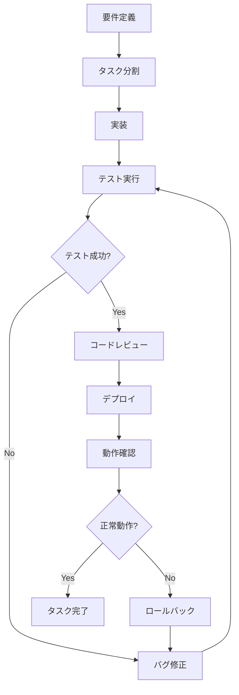

# 開発プロセスとワークフロー

> **最終更新**: 2025/08/01  
> **文書種別**: 正式仕様書  
> **更新頻度**: 定期的

## 概要

insurance_gameプロジェクトの開発プロセスと標準的なワークフローについて定義します。

## 1. 開発哲学

### コア原則
- **プレイヤー体験至上主義**: すべての機能実装はプレイヤーの楽しさを最優先に考える
- **1 TODO = 1 Deploy**: 小さなタスクを完了するたびにデプロイを実行
- **テスト成功率100%の厳守**: すべてのテストが成功するまで作業は完了していない
- **シンプリシティの追求**: 最小限の要素で最大限の楽しさを提供

### 品質基準
1. **機能性**: 設計通りに動作する
2. **性能性**: 高速なレスポンスを維持
3. **保守性**: 他の開発者が理解・拡張できる
4. **アクセシビリティ**: 多様な環境・ユーザーに対応

## 2. 開発ワークフロー

### 標準的な開発サイクル



### 日次開発プロセス

#### 朝の開始時（9:00-9:30）
1. **プロジェクトビジョンの確認**
   - CLAUDE.mdの読み返し
   - 今日の目標設定

2. **環境確認**
   ```bash
   # 依存関係の確認
   npm install
   
   # 型チェック
   npm run type-check
   
   # テスト実行
   npm run test:run
   ```

3. **タスクの選択**
   - TodoWriteで管理されたタスクから選択
   - 30分〜2時間で完了できるサイズ

#### 実装フェーズ（9:30-17:00）
1. **機能実装**
   - 必要に応じてSubAgentを活用
   - テスト駆動開発（TDD）の実践

2. **品質チェック**
   ```bash
   # Lint実行
   npm run lint
   
   # 型チェック
   npm run type-check
   
   # 全テスト実行
   npm run test:run
   ```

3. **デプロイ**
   ```bash
   # 変更のコミット
   git add <specific-files>
   git commit -m "実装内容の説明"
   
   # プッシュ（GitHub Actionsで自動デプロイ）
   git push origin master
   ```

#### 夕方の振り返り（17:00-17:30）
1. **成果の確認**
   - 実装した機能のテストプレイ
   - 本番環境での動作確認

2. **改善点の記録**
   - 発見した問題点の文書化
   - 次回への引き継ぎ事項

## 3. タスク管理

### TodoWriteによるタスク管理
- **タスクサイズ**: 30分〜2時間で完了可能
- **ステータス管理**: pending → in_progress → completed
- **同時進行**: 1つのタスクのみin_progressに設定

### タスクの分割基準
- **大きすぎる場合**: 半日を超える作業は必ず分割
- **小さすぎる場合**: 15分未満の作業は他のタスクと統合
- **依存関係**: 前のタスクの完了が必要な場合は明記

### 完了基準
- すべてのテストが成功
- Lintエラーが解決
- 型チェックエラーが解決
- デプロイが成功
- 本番環境で正常動作確認

## 4. ブランチ戦略

### メインブランチ
- **master**: 本番環境に直接デプロイされる
- 常に動作する状態を維持
- 直接プッシュ可能（小規模プロジェクトのため）

### 機能ブランチ（大きな変更時のみ）
- **feature/***: 大きな機能追加時のみ使用
- プルリクエストによるレビュー
- 完了後はマージして削除

## 5. コミットメッセージ規約

### 形式
```
<type>: <subject>

<body>

🤖 Generated with [Claude Code](https://claude.ai/code)

Co-Authored-By: Claude <noreply@anthropic.com>
```

### Type分類
- **feat**: 新機能の追加
- **fix**: バグ修正
- **docs**: ドキュメントのみの変更
- **style**: コードの動作に影響しないスタイル変更
- **refactor**: バグ修正や機能追加を伴わないコード変更
- **test**: テストの追加や修正
- **chore**: ビルドプロセスやツール関連の変更

### Subject規則
- 50文字以内
- 命令形で記述
- 最初の文字は小文字
- 末尾にピリオドを付けない

## 6. レビュープロセス

### セルフレビュー（必須）
1. **コードの品質確認**
   - 命名規則の遵守
   - 適切なコメント
   - DRY原則の適用

2. **テストカバレッジ**
   - 新機能に対するテスト
   - エッジケースの考慮

3. **パフォーマンス影響**
   - バンドルサイズの確認
   - 実行時パフォーマンス

### 外部レビュー（大きな変更時）
- プルリクエストでの同僚レビュー
- 設計レビュー会議
- ユーザビリティテスト

## 7. 緊急対応プロセス

### 本番障害発生時
1. **即座の対応**
   - 障害の範囲と影響を確認
   - 必要に応じてロールバック

2. **原因調査**
   - ログの確認
   - エラーの再現

3. **修正と検証**
   - 修正パッチの作成
   - テスト環境での検証
   - 本番環境への適用

4. **事後対応**
   - インシデントレポートの作成
   - 再発防止策の検討

## 8. チェックリスト

### 実装前チェックリスト
- [ ] 要件が明確に定義されている
- [ ] タスクが適切なサイズに分割されている
- [ ] 必要な技術調査が完了している
- [ ] テスト戦略が決まっている

### 実装中チェックリスト
- [ ] テストファーストで開発している
- [ ] コミットメッセージが規約に従っている
- [ ] 定期的にテストを実行している
- [ ] コードレビューを実施している

### 実装後チェックリスト
- [ ] すべてのテストが成功している
- [ ] Lintエラーが解決している
- [ ] 型チェックエラーが解決している
- [ ] デプロイが成功している
- [ ] 本番環境で正常動作している
- [ ] ドキュメントが更新されている

## 9. 継続的改善

### 週次振り返り
- 開発速度の測定
- 品質指標の確認
- プロセス改善点の検討

### 月次評価
- 目標達成度の確認
- 技術負債の評価
- 開発体制の見直し

### 四半期レビュー
- 開発戦略の見直し
- 新技術導入の検討
- チーム構成の最適化

## 関連ドキュメント

- [コードレビュー基準](./CODE_REVIEW_STANDARDS.md)
- [リリース管理戦略](./RELEASE_MANAGEMENT.md)
- [品質保証戦略](./QUALITY_ASSURANCE.md)
- [開発原則](../development/PRINCIPLES.md)
- [テストガイドライン](../development/TEST_GUIDELINES.md)